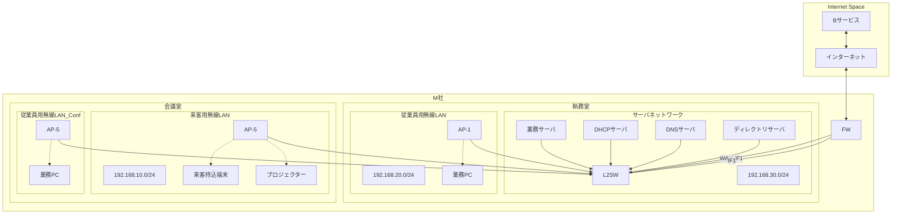

## 問2 セキュリティ対策の見直しに関する次の記述を読んで、設問に答えよ。

M社は、L社の子会社であり、アパレル業を手掛ける従業員100名の会社である。 M社のオフィスビルは、人通りの多い都内の大通りに面している。

昨年、M社の従業員が、社内ファイルサーバに保存していた秘密情報の商品デザインファイルをUSBメモリに保存し、競合他社に持ち込むという事件が発生した。 この事件を契機として、L社からの指導でセキュリティ対策の見直しを進めている。 既に次の三つの見直しを行った。

  * USBメモリへのファイル保存を防ぐために、従業員に貸与するノートPC (以下,業務PCという)に情報漏えい対策ソフトを導入し、次のように設定した。
    1.  USBメモリなどの外部記憶媒体の接続を禁止する。
    2.  ソフトウェアのインストールを除いて、ローカルディスクへのファイルの保存を禁止する。
    3.  会社が許可していない Web メールサービス及びクラウドストレージサービスへの通信を遮断する。
    4.  会社が許可していないソフトウェアのインストールを禁止する。
    5.  電子メール送信時のファイルの添付を禁止する。
  * 業務用のファイルの保存場所を以前から利用していたクラウドストレージサービス(以下,Bサービスという)の1か所にまとめ、設定を見直した。
  * 社内ファイルサーバを廃止した。

M社のオフィスビルには、執務室と会議室がある。 執務室では従業員用無線LANが利用可能であり、会議室では、従業員用無線LANと来客用無線LANの両方が利用可能である。 会議室にはプロジェクターが設置されており、来客が持ち込む PC, タブレット及びスマートフォン (以下、これらを併せて来客持込端末という) 又は業務 PCを来客用無線LANに接続することで利用可能である。

M社のネットワーク構成を図1に、その構成要素の概要を表1に、M社のセキュリティルールを表2に示す。

**図1 M社のネットワーク構成**
*FW: ファイアウォール*
*L2SW: レイヤー2スイッチ*
*AP: 無線LANアクセスポイント*
*注記1 IF1, WAN-IF1はFWのインタフェースを示す。*
*注記2 P9~P13及びP20~P24はL2SWのポートを示す。*
*注記3 L2SWはVLAN機能をもっており、各ポートには接続されている機器のネットワークに対応したVLAN ID が割り当てられている。 P9とP24ではタグ VLANが有効化されており、そのほかのポートでは無効化されている。 有効化されている場合、複数のVLAN ID が割当て可能である。 無効化されている場合、一つのVLAN ID だけが割当て可能である。*

**表1 構成要素の概要(抜粋)**
*注) a1.b1.c1.d1はグローバルIPアドレスを示す。*
| 構成要素 | 概要 |
| :--- | :--- |
| FW | ・通信制御はステートフルパケットインスペクション型である ・NAT 機能を有効にしている。 ・DHCP リレー機能を有効にしている。 |
| AP-1~5 | ・無線LANの認証方式は WPA2-PSK である。  ・AP-1~4には、従業員用無線LANのSSID が設定されている。  ・AP-5には、従業員用無線LANのSSID と来客用無線LANのSSID の両方が設定されている。  ・従業員用無線 LAN だけに MAC アドレスフィルタリングが設定されており、事前に情報システム部で登録された業務 PCだけが接続できる。  ・同じSSIDの無線LANに接続された端末同士は、通信可能である。 |
| Bサービス | ・HTTPS でアクセスする。  ・HTTP Strict Transport Security (HSTS) を有効にしている。  ・従業員ごとに割り当てられた利用者 IDとパスワードでログインし、利用する。  ・M社の従業員に割り当てられた利用者 ID では、a1.b1.c1.d1 からだけ、Bサービスにログイン可能である。  ・ファイル共有機能がある。 従業員がM社以外の者と業務用のファイルを共有するには、Bサービス上で、共有したいファイルの指定、外部の共有者のメールアドレスの入力及び上長承認申請を行い、上長が承認する。 承認されると、指定されたファイルの外部との共有用 URL (以下,外部共有リンクという)が発行され、外部の共有者宛てに電子メールで自動的に送信される。 外部共有リンクは、本人及び上長には知らされない。 外部の共有者は外部共有リンクにアクセスすることによって、Bサービスにログインせずにファイルをダウンロード可能である。 外部共有リンクは、発行されるたびに新たに生成される推測困難なランダム文字列を含み、有効期限は1日に設定されている。 |
| 業務 PC | ・日常業務のほか、Bサービスへのアクセス、インターネットの閲覧、電子メールの送受信などに利用する。  ・TPM (Trusted Platform Module) 2.0を搭載している。 |
| DHCP サーバ | ・業務 PC,来客持込端末にIPアドレスを割り当てる。 |
| DNS サーバ | ・業務PC,来客持込端末が利用する DNS キャッシュサーバである。  ・インターネット上のドメイン名の名前解決を行う。 |
| ディレクトリサーバ | ・ディレクトリ機能に加え、ソフトウェア、クライアント証明書などを業務 PCにインストールする機能がある。 |

**表2 M社のセキュリティルール (抜粋)**
| 項目 | セキュリティルール |
| :--- | :--- |
| 業務 PCの持出し | ・社外への持出しを禁止する。 |
| 業務 PC以外の持込み | ・個人所有のPC、タブレット、スマートフォンなどの機器の執務室への持込みを禁止する。 |
| 業務用のファイルの持出し | ・B サービスのファイル共有機能以外の方法での社外への持出しを禁止する。 |

FWのVLAN インタフェース設定を表3に、FWのフィルタリング設定を表4に、AP-5の設定を表5に示す。

**表3 FWのVLAN インタフェース設定**
*注) 物理インタフェースでのタグ VLANの設定を示す。 有効の場合、複数のVLAN ID が割当て可能である。 無効の場合、一つのVLAN IDだけが割当て可能である。*
| 項番 | 物理インタフェース名 | タグ VLAN | VLAN 名 | VLAN ID | IP アドレス | サブネットマスク |
| :--- | :--- | :--- | :--- | :--- | :--- | :--- |
| 1 | IF1 | 有効 | VLAN10 | 10 | 192.168.10.1 | 255.255.255.0 |
| 2 | | | VLAN20 | 20 | 192.168.20.1 | 255.255.255.0 |
| 3 | | | VLAN30 | 30 | 192.168.30.1 | 255.255.255.0 |
| 4 | WAN-IF1 | 無効 | VLAN1 | 1 | a1.b1.c1.d1 | 255.255.255.248 |

**表4 FWのフィルタリング設定**
*注記1) 項番が小さいルールから順に、最初に合致したルールが適用される。*
*注記2) 現在の設定では有効の場合、送信元 IPアドレスがa1.b1.c1.d1に変換される。*
| 項番 | 入力インタフェース | 出力インタフェース | 送信元 IP アドレス | 宛先IPアドレス | サービス | 動作 | NAT |
| :--- | :--- | :--- | :--- | :--- | :--- | :--- | :--- |
| 1 | IF1 | WAN-IF1 | 192.168.10.0/24 | 全て | HTTP, HTTPS | 許可 | 有効 |
| 2 | IF1 | WAN-IF1 | 192.168.20.0/24 | 全て | HTTP, HTTPS | 許可 | 有効 |
| 3 | IF1 | WAN-IF1 | 192.168.30.0/24 | 全て | HTTP, HTTPS, DNS | 許可 | 有効 |
| 4 | IF1 | IF1 | 192.168.10.0/24 | 192.168.30.0/24 | DNS | 許可 | 無効 |
| 5 | IF1 | IF1 | 192.168.20.0/24 | 192.168.30.0/24 | 全て | 許可 | 無効 |
| 6 | IF1 | IF1 | 192.168.30.0/24 | 192.168.20.0/24 | 全て | 許可 | 無効 |
| 7 | 全て | 全て | 全て | 全て | 全て | 拒否 | 無効 |

**表5 AP-5 の設定 (抜粋)**
| 項目 | 設定1 | 設定2 |
| :--- | :--- | :--- |
| SSID | m-guest | m-employee |
| 用途 | 来客用無線LAN | 従業員用無線LAN |
| 周波数 | 2.4GHz | 2.4GHz |
| SSID 通知 | 有効 | 無効 |
| 暗号化方法 | WPA2 | WPA2 |
| 認証方式 | WPA2-PSK | WPA2-PSK |
| 事前共有キー (WPA2-PSK) | Mkr4bof2bh0tjt | Kxwekreb85gjbp5gkgajfg |
| タグ VLAN | 有効 | 有効 |
| VLAN ID | 10 | 20 |

### [Bサービスからのファイルの持出しについてのセキュリティ対策の確認]

これまで行った対策の見直しに引き続き、Bサービスからのファイルの持出しのセキュリティ対策について、十分か否かの確認を行うことになった。 そこで、情報システム部のYさんが、L社の情報処理安全確保支援士(登録セキスペ)であるS氏の支援を受けながら、確認することになった。 2人は、社外の攻撃者による持出しと従業員による持出しのそれぞれについて、セキュリティ対策を確認することにした。

#### [社外の攻撃者によるファイルの持出しについてのセキュリティ対策の確認]

次は、社外の攻撃者によるBサービスからのファイルの持出しについての、YさんとS氏の会話である。
**Yさん:** 来客用無線LANを利用したことのある来客者が、攻撃者としてM社の近くから来客用無線LANに接続し、Bサービスにアクセスするということが考えられないでしょうか。
**S氏:** それは考えられます。 しかし、Bサービスにログインするには a と b が必要です。
**Yさん:** 来客用無線LANのAPと同じ設定の偽のAP (以下、偽APという)、及びBサービスと同じ URL の偽のサイト(以下、偽サイトという)を用意し、DNSの設定を細工して、 a と b を盗む方法はどうでしょうか。攻撃者が偽APをM社の近くに用意した場合に、M社の従業員が業務 PCを偽AP に誤って接続してB サービスにアクセスしようとすると、偽サイトにアクセスすることになり、ログインしてしまうことがあるかもしれません。
**S氏:** 従業員がHTTPSで偽サイトにアクセスしようとすると、安全な接続ではないという旨のエラーメッセージとともに、偽サイトに使用されたサーバ証明書に応じて、図2に示すエラーメッセージの詳細の一つ以上がWeb ブラウザに表示されます。従業員は正規のサイトでないことに気付けるので、ログインしてしまうことはないと考えられます。

**図2 エラーメッセージの詳細(抜粋)**

  * c
  * d
  * このサーバ証明書は、失効している。
  * このサーバ証明書は、有効期限が切れている。

**Yさん:** なるほど、理解しました。 しかし、偽AP に接続した状態で、従業員が WebブラウザにBサービスのURLを入力する際に、誤って`http://`と入力してBサービスにアクセスしようとした場合、エラーメッセージが表示されないのではないでしょうか。
**S氏:** 大丈夫です。 HSTSを有効にしてあるので、その場合でも、①<u>先ほどと同じエラーメッセージが表示されます</u>。

#### [従業員によるファイルの持出しについてのセキュリティ対策の確認]

次は、従業員によるBサービスからのファイルの持出しについての、S氏とYさんとの会話である。
**S氏:** ファイル共有機能では、上長はちゃんと宛先のメールアドレスとファイルを確認してから承認を行っていますか。
**Yさん:** 確認できていない上長もいるようです。
**S氏:** そうすると、従業員は、②<u>ファイル共有機能を悪用すれば、M社外からBサービスにあるファイルをダウンロード可能</u>ですね。
**Yさん:** 確かにそうです。
**S氏:** ところで、会議室には個人所有PCは持ち込めるのでしょうか。
**Yさん:** 会議室への持込みは禁止していないので、持ち込めます。
**S氏:** そうだとすると、次の方法1と方法2のいずれかの方法を使って、Bサービスからファイルの持出しが可能ですね。

  * **方法1:** 個人所有PCの無線LAN インタフェースの e を業務 PCの無線LAN インタフェースの e に変更した上で、個人所有PCを従業員用無線LAN に接続し、Bサービスからファイルをダウンロードし、個人所有PCごと持ち出す。
  * **方法2:** 個人所有PCを来客用無線LANに接続し、Bサービスからファイルをダウンロードし、個人所有PC ごと持ち出す。

#### [方法1と方法2についての対策の検討〕

方法1への対策については、従業員用無線LAN の認証方式として EAP-TLS を選択し、③<u>認証サーバを用意する</u>ことにした。

次は、必要となるクライアント証明書についてのS氏とYさんの会話である。
**S氏:** クライアント証明書とそれに対応する f は、どのようにしますか。
**Yさん:** クライアント証明書は、CA サーバを新設して発行することにし、従業員が自身の業務 PCにインストールするのではなく、ディレクトリサーバの機能で業務 PCに格納します。f は g しておくために業務 PCのTPMに格納し、保護します。
**S氏:** ④<u>その格納方法であれば問題ないと思います</u>。

方法2への対策については、次の二つの案を検討した。

  * ⑤<u>FWのNAT の設定を変更する</u>。
  * 無線LANサービスであるDサービスを利用する。

検討の結果、Dサービスを次のとおり利用することにした。

  * 会議室に、Dサービスから貸与された無線LANルータ(以下, Dルータという)を設置する。
  * Dルータでは、DHCP サーバ機能及びDNSキャッシュサーバ機能を有効にする。
  * 来客持込端末は、M社のネットワークを経由せずに、Dルータに搭載されているSIMを用いてDサービスを利用し、インターネットに接続する。

今まで必要だった、来客持込端末から DHCP サーバと h サーバへの通信は、不要になる。 さらに、表5について不要になった設定を削除するとともに、⑥<u>表3及び表4についても、不要になった設定を全て削除する</u>。 また、プロジェクターについては、来客用無線LANを利用せず、HDMIケーブルで接続する方法に変更する。

YさんとS氏は、ほかにも必要な対策を検討し、これらの対策と併せて実施した。

### 設問1

[社外の攻撃者によるファイルの持出しについてのセキュリティ対策の確認〕について答えよ。
(1) 本文中の a 、 b に入れる適切な字句を答えよ。
(2) 図2中の c 、 d に入れる適切な字句を、それぞれ40字以内で答えよ。
(3) 本文中の下線①について、エラーメッセージが表示される直前までの Webブラウザの動きを 60字以内で答えよ。

### 設問2

〔従業員によるファイルの持出しについてのセキュリティ対策の確認〕について答えよ。
(1) 本文中の下線②について、M 社外からファイルをダウンロード可能にするためのファイル共有機能の悪用方法を 40字以内で具体的に答えよ。
(2) 本文中の e に入れる適切な字句を答えよ。

### 設問3

[方法1と方法2についての対策の検討] について答えよ。
(1) 本文中の下線③について、認証サーバがEAP で使う UDP 上のプロトコルを答えよ。
(2) 本文中の f に入れる適切な字句を答えよ。
(3) 本文中の g に入れる適切な字句を、20字以内で答えよ。
(4) 本文中の下線④について、その理由を、40字以内で答えよ。
(5) 本文中の下線⑤について、変更内容を、70字以内で答えよ。
(6) 本文中の h に入れる適切な字句を答えよ。
(7) 本文中の下線⑥について、表3及び表4の削除すべき項番を、それぞれ全て答えよ。

-----
