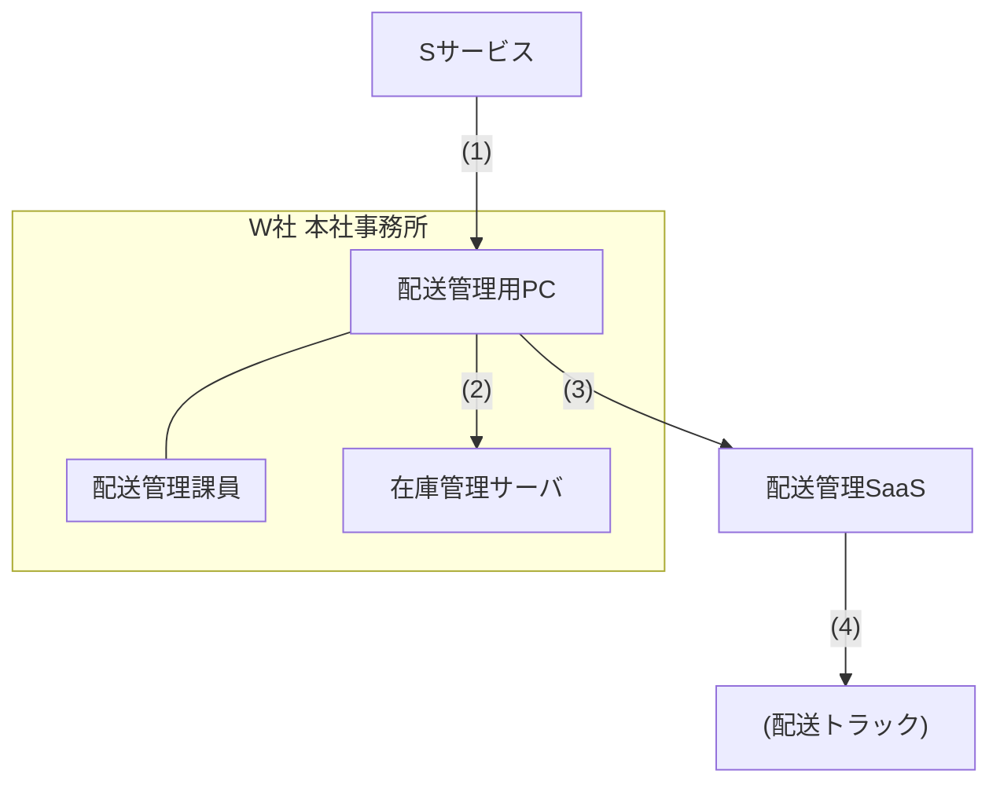
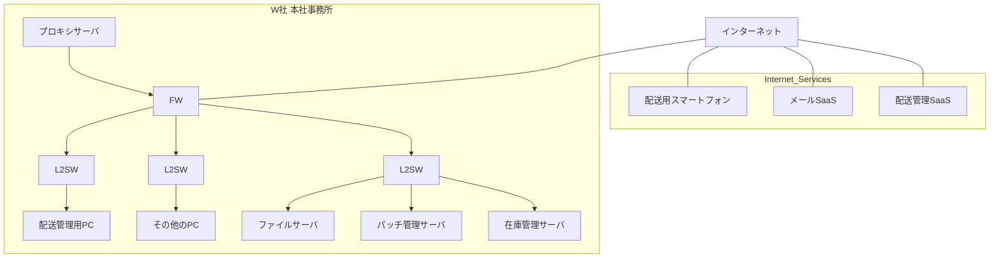

## 問4 リスクアセスメントに関する次の記述を読んで、設問に答えよ。

G百貨店は、国内で5店舗を営業している。 G百貨店では、贈答品として販売される菓子類のうち、特定の地域向けに配送されるもの(以下、菓子類Fという)の配送と在庫管理をW社に委託している。

### 〔W社での配送業務〕

W社は従業員 100名の地域運送会社で、本社事務所と倉庫が同一敷地内にあり、それ以外の拠点はない。

G百貨店では、贈答品の受注情報を、Sサービスという受注管理 SaaS に登録している。 菓子類Fの受注情報(以下、菓子類Fの受注情報をZ情報という)が登録された後の、W社の配送業務におけるデータの流れは、図1のとおりである。

**図1 W社の配送業務におけるデータの流れ**

1.  配送管理課員が、Sサービスにアクセスして、G百貨店が登録したZ情報を参照する。
2.  配送管理課員が、在庫管理サーバにアクセスして、倉庫内の在庫品の引当てを行う。
3.  配送管理課員が、配送管理SaaSにアクセスして、配送指示を入力する。
4.  配送員が、倉庫の商品を配送するために、配送用スマートフォンで配送管理SaaSの配送指示を参照する。

W社の配送管理課では、毎日09:00-21:00の間、常時稼働1名として6時間交代で配送管理業務を行っている。配送管理用PCは1台を交代で使用している。

Sサービスに登録されたZ情報をW社が参照できるようにするために、G百貨店は、自社に発行されたSサービスのアカウントを一つW社に貸与している(以下,G百貨店がW社に貸与しているSサービスのアカウントを貸与アカウントという)。 貸与アカウントでは、Z情報だけにアクセスできるように権限を設定している。 なお、SサービスとW社の各システムは直接連携しておらず、W社の配送管理課員がZ情報を参照して、在庫管理サーバ及び配送管理 SaaS に入力している。1日当たりのZ情報の件数は10~50件である。 Z情報には、配送先の住所・氏名・電話番号の情報が含まれている。 配送先の情報に不備がある場合は、配送員が配送管理課に電話で問い合わせることがある。 なお、配送に関するG百貨店からW社への特別な連絡事項は、電子メール(以下、メールという)で送られてくる。

### 〔リスクアセスメントの開始〕

ランサムウェアによる“二重の脅迫”が社会的な問題となったことをきっかけに、G 百貨店では全ての情報資産を対象にしたリスクアセスメントを実施することになり、セキュリティコンサルティング会社であるE社に作業を依頼した。 リスクアセスメントの開始に当たり、G百貨店は、G百貨店の情報資産を取り扱っている委託先に対して、E社の調査に応じるよう要請し、承諾を得た。 この中にはW社も含まれていた。
情報資産のうち贈答品の受注情報に関するリスクアセスメントは、E社の情報処理安全確保支援士 (登録セキスペ) のTさんが担当することになった。 Tさんは、まずZ 情報の機密性に限定してリスクアセスメントを進めることにして、必要な調査を実施した。 Tさんは、調査結果として、Sサービスの仕様と G百貨店の設定状況を表 1に、W社のネットワーク構成を図2に、W社の情報セキュリティの状況を表2にまとめた。

**表1 Sサービスの仕様とG百貨店の設定状況(抜粋)**
| 項番 | 仕様 | G百貨店の設定状況 |
| :--- | :--- | :--- |
| 1 | 利用者認証において、利用者 ID (以下, ID という)とパスワード(以下、PW という)の認証のほかに、時刻同期型のワンタイムパスワードによる認証を選択することができる。 | IDとPWでの認証を選択している。 |
| 2 | 同一アカウントで重複ログインをすることができる。 | 設定変更はできない |
| 3 | ログインを許可するアクセス元 IP アドレスのリストを設定することができる。 IPアドレスのリストは、アカウントごとに設定することができる。 | 全てのIPアドレスからのログインを許可している。 |
| 4 | 検索した受注情報をファイルに一括出力する機能(以下,一括出力機能という)があり、アカウントごとに機能の利用の許可/禁止を選択できる。 | 全てのアカウントに許可している。 |
| 5 | 契約ごとに設定される管理者アカウントは、契約範囲内の全てのアカウントの操作ログを参照することができる。 | 設定変更はできない |
| 6 | Sサービスへのアクセスは、HTTPSだけが許可されている。 | 設定変更はできない |

**図2 W社のネットワーク構成**
*FW: ファイアウォール*
*L2SW: レイヤー2スイッチ*

**表2 W社の情報セキュリティの状況**
| 項番 | カテゴリ | 情報セキュリティの状況 |
| :--- | :--- | :--- |
| 1 | 技術的セキュリティ対策 | PC 及びサーバへのログイン時は、各PC及びサーバに登録されたIDとPWで認証している。 PWは、十分に長く、推測困難なものを使用している。 |
| 2 | | 全てのPCとサーバに、パターンマッチング型のマルウェア対策ソフトを導入している。 定義ファイルの更新は、遅滞なく行われている。 |
| 3 | | 全てのPC、サーバ及び配送用スマートフォンで、脆弱性修正プログラムの適用は、遅滞なく行われている。 |
| 4 | | FWは、ステートフルパケットインスペクション型で、インターネットからW社への全ての通信を禁止している。 W社からインターネットへの通信は、プロキシサーバからの必要な通信だけを許可している。 そのほかの通信は、必要なものだけを許可している。 |
| 5 | | メール SaaS には、セキュリティ対策のオプションとして次のものがある。 一つ目だけを有効としている。  ・添付ファイルに対するパターンマッチング型マルウェア検査 ・迷惑メールのブロック ・特定のキーワードを含むメールの送信のブロック |
| 6 | | プロキシサーバは、社内の全てのPCとサーバから、インターネットへのHTTPと HTTPSの通信を転送する。 URL フィルタリング機能があり、アダルトとギャンブルのカテゴリだけを禁止している。 HTTPS 復号機能はもっていない。 |
| 7 | | PCでは、OS の設定によって、取外し可能媒体への書込みを禁止している。 この設定を変更するには、管理者権限が必要である。 なお、管理者権限は、システム管理者だけがもっている。 |
| 8 | 物理的セキュリティ対策 | 本社事務所は IC カードによる入退管理が施されていて、従業員以外は立ち入ることができない。 本社事務所に入った後は特に制限はなく、従業員は誰でも配送管理用 PCに近づくことができる。 |
| 9 | 人的セキュリティ対策 | 標的型攻撃に関する周知は行っているが、訓練は実施していない。 |
| 10 | | 全従業員に対して、次の基本的な情報セキュリティ研修を行っている。  ・IDとPWを含む、秘密情報の取扱方法 ・マルウェア検知時の対応手順 ・PC及び配送用スマートフォンの取扱方法 ・個人情報の取扱方法 ・メール送信時の注意事項 |
| 11 | | 聞取り調査の結果、従業員の倫理意識は十分に高いことが判明した。 不正行為の動機付けは十分に低い。 |
| 12 | 貸与アカウントのPWの管理 | 配送管理課長が毎月PWを変更し、IDと変更後のPWをメールで配送管理課員全員に周知している。 PWは英数記号のランダム文字列で、十分な長さがある。 その日の配送管理課のシフトに応じて、当番となった者がアカウントを使用する。 |
| 13 | | PW は暗記が困難なので、配送管理課長は課員に対して、PWはノートなどに書いてもよいが、他人に見られないように管理するよう指示している。 しかし、配送管理課で、PWを書いた付箋が、机上に貼ってあった。 |

Tさんは、G百貨店が定めた図3のリスクアセスメントの手順に従って、Z情報の機密性に関するリスクアセスメントを進めた。

**図3 リスクアセスメントの手順**

1.  **リスク特定**
    1.  リスク源を洗い出し、“リスク源”欄に記述する。
    2.  (1)のリスク源が行う行為、又はリスク源が起こす事象の分類を、“行為又は事象の分類”欄に記述する。
    3.  (1)と(2)について、リスク源が行う行為、又はリスク源が起こす事象を、“リスク源による行為又は事象”欄に記述する。
    4.  (3)の行為又は事象を発端として、Z情報の機密性への影響に至る経緯を、“Z情報の機密性への影響に至る経緯” 欄に記述する。
2.  **リスク分析**
    1.  1で特定したリスクに関して、関連する情報セキュリティの状況を表2から選び、その項番全てを“情報セキュリティの状況”欄に記入する。 該当するものがない場合は“なし”と記入する。
    2.  (1)の情報セキュリティの状況を考慮に入れた上で、“Z情報の機密性への影響に至る経緯”のとおりに進行した場合の被害の大きさを“被害の大きさ”欄に次の3段階で記入する。
          * **大:** ほぼ全てのZ情報について、機密性が確保できない。
          * **中:** 一部のZ情報について、機密性が確保できない。
          * **小:** “Z 情報の機密性への影響に至る経緯”だけでは機密性への影響はないが、ほかの要素と組み合わせることによって影響が生じる可能性がある。
    3.  (1)の情報セキュリティの状況を考慮に入れた上で、“リスク源による行為又は事象”が発生し、かつ、“Z情報の機密性への影響に至る経緯”のとおりに進行する頻度を、“発生頻度”欄に次の3段階で記入する。
          * **高:** 月に1回以上発生する。
          * **中:** 年に2回以上発生する。
          * **低:** 発生頻度は年に2回未満である。
3.  **リスク評価**
    1.  表3のリスクレベルの基準に従い、リスクレベルを“総合評価”欄に記入する。

**表3 リスクレベルの基準**
| 発生頻度 | 被害の大きさ: 大 | 被害の大きさ: 中 | 被害の大きさ: 小 |
| :--- | :--- | :--- | :--- |
| 高 | A | B | C |
| 中 | B | C | D |
| 低 | C | D | D |

*A: リスクレベルは高い。*
*B: リスクレベルはやや高い。*
*C: リスクレベルは中程度である。*
*D: リスクレベルは低い。*

Tさんは、表4のリスクアセスメントの結果をG百貨店に報告した。

**表4 リスクアセスメントの結果(抜粋)**
| リスク番号 | リスク源 | 行為又は事象の分類 | リスク源による行為又は事象 | Z情報の機密性への影響に至る経緯 | 情報セキュリティの状況 | 被害の大きさ | 発生頻度 | 総合評価 |
| :--- | :--- | :--- | :--- | :--- | :--- | :--- | :--- | :--- |
| 1-1 | W社従業員 | IDとPWの持出し(故意) | SサービスのIDとPWをメモ用紙などに書き写して、持ち出す。 | W社従業員によって持ち出された IDとPWが利用され、W社外からSサービスにログインされて、Z情報がW社外のPCなどに保存される。 | ア | イ | 低 | ウ |
| 1-2 | | Z情報の持出し(故意) | 故意に、SサービスのIDとPWを、W社外の第三者にメールで送信する。 | メールを受信したW 社外の第三者によって、メールに記載されたIDとPWが利用され、W社外からSサービスにログインされて、Z情報がW社外の PCなどに保存される。 | (省略) | 大 | 低 | C |
| 1-3 | | | Z情報を表示している画面を、個人所有のスマートフォンで写真撮影して保存する。 | W 社従業員によって、個人所有のスマートフォン内に保存された Z 情報の写真が、W社外に持ち出される。 | (省略) | 中 | 低 | D |
| 1-4 | | | 配送管理用PCで、一括出力機能を利用して、Z情報をファイルに書き出し、W社外の第三者にメールで送信する。 | メールを受信した W社外の第三者に、Z情報が漏えいする。 | (省略) | 大 | 低 | C |
| 1-5 | | IDとPWの漏えい(過失) | 誤って、SサービスのIDとPWを、W社外の第三者にメールで送信する。 | リスク番号 1-2と同じ | a | 大 | 低 | C |
| 2-1 | W 社外の第三者 | W社へのサイバー攻擊 | S サービスの偽サイトを作った上で、偽サイトに誘導するフィッシングメールを、配送管理課員宛てに送信する。 | 配送管理課員が、フィッシングメール内のリンクをクリックし、偽サイトにアクセスして、IDとPWを入力してしまう。 入力されたIDとPWが利用され、W社外からSサービスにログインされて、Z情報がW社外のPCなどに保存される。 | (省略) | 大 | 低 | C |
| 2-2 | | | W社のPC又はサーバの脆弱性を悪用し、インターネット上のPCからW社のPC又はサーバを不正に操作する。 | 不正に操作された PC 又はサーバが踏み台にされて、配送管理用 PC にキーロガーが埋め込まれ、SサービスのIDとPWが窃取される。 そのIDとPWが利用され、W社外からSサービスにログインされて、Z情報がW社外のPCなどに保存される。 | b | 大 | 低 | C |
| 2-3 | | | | 不正に操作された PC 又はサーバが踏み台にされて、配送管理課長のPCに不正にログインされる。 その後、送信済みのメールが読み取られ、SサービスのIDとPWが窃取される。 そのIDとPWが利用され、W社外から S サービスにログインされて、Z情報がW社外のPCなどに保存される。 | (省略) | 大 | 低 | C |
| 2-4 | | | あ | い | う | え | お | か |
| 2-5 | | ソーシャルエンジニアリング | 配送員を装って、配送管理課員に電話で問い合わせる。 | (省略) | (省略) | 中 | 低 | D |

### 〔リスクの管理策の検討〕

報告を受けた後、G百貨店は、総合評価がA~Cのリスクについて、リスクを低減するために追加すべき管理策の検討をE社に依頼した。 依頼に当たり、G百貨店は次のとおり条件を提示した。

  * 図1のデータの流れを変更しない前提で管理策を検討すること
  * リスク番号1-1及び2-4については、総合評価にかかわらず、管理策を検討すること

依頼を受けたE社は、Tさんをリーダーとする数名のチームが管理策を検討した。
追加すべき管理策の検討結果を表5に示す。

**表5 追加すべき管理策の検討結果(抜粋)**
| リスク番号 | 管理策 |
| :--- | :--- |
| 1-1 | ・G百貨店で、Sサービスの利用者認証を、多要素認証に変更する。 ・G 百貨店で、Sサービスの操作ログを常時監視し、不審な操作を発見したらブロックする。|
| 1-2, 1-4 | ・G 百貨店で、Sサービスの利用者認証を、多要素認証に変更する。  ・G 百貨店で、Sサービスの操作ログを常時監視し、不審な操作を発見したらブロックする。  ・W社でメール SaaS の“特定のキーワードを含むメールの送信のブロック”を行う。  ・G 百貨店で、Sサービスの設定を変更し、一括出力機能の利用を禁止する。 |
| 1-5 | ・リスク番号 1-2の管理策と同じ |
| 2-1 | (省略) |
| 2-2 | (省略) |
| 2-3 | (省略) |
| 2-4 | き |

その後、Tさんは、Z 情報の完全性及び可用性についてのリスクアセスメント、並びに菓子類F以外の贈答品の受注情報についてのリスクアセスメントを行い、必要に応じて管理策を検討した。

E社から全ての情報資産のリスクアセスメント結果及び追加すべき管理策の報告を受けたG百貨店は、報告内容からW社に関連する部分を抜粋してW社にも伝えた。G百貨店とW社は、幾つかの管理策を実施し、順調に贈答品の販売及び配送を行っている。

### 設問1

表4及び表5中の ア ～ エ に入れる適切な字句を答えよ。
ア は、表2中から該当する項番を全て選び、数字で答えよ。 該当する項番がない場合は、“なし”と答えよ。 イ は答案用紙の大・中・小のいずれかの文字を○で囲んで示せ。 ウ は答案用紙のA・B・C・Dのいずれかの文字を○で囲んで示せ。

### 設問2

次の問いに答えよ。
(1) 表4中の あ に入れる適切な字句を、本文に示した状況設定に沿う範囲で、あなたの知見に基づき、答えよ。
(2) 解答した あ の内容に基づき、表4及び表 5 中の い ～ き に入れる適切な字句を答えよ。い は、表2中から該当する項番を全て選び、数字で答えよ。該当する項番がない場合は、“なし”と答えよ。 う は答案用紙の大・中・小のいずれかの文字を○で囲んで示せ。 え は答案用紙の高・中・低のいずれかの文字を○で囲んで示せ。 お は答案用紙のA・B・C・Dのいずれかの文字を○で囲んで示せ。

### 設問3

表4中の a 、 b に入れる適切な字句について、表2中から該当する項番を全て選び、数字で答えよ。該当する項番がない場合は、“なし”と答えよ。

