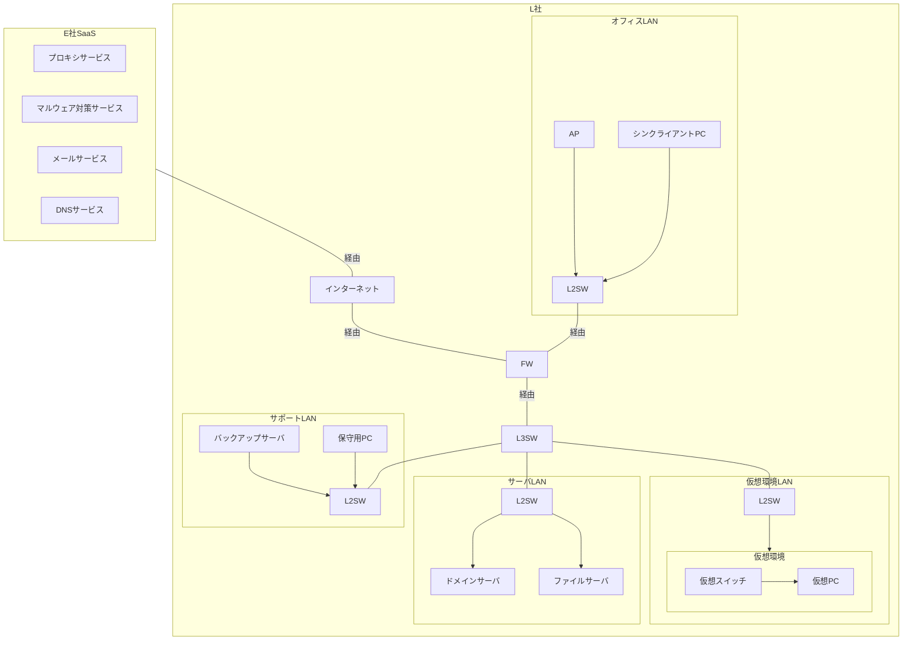

## 問1 インシデントレスポンスに関する次の記述を読んで、設問に答えよ。

L社は、従業員 100名のソフトウェア開発会社である。L社の社内システムは、情報システム部(以下,情シス部という)が、運用及びインシデント対応を行っている。
L社は、E社のSaaS を使用している。L社のネットワーク構成を図1に、図1の各構成要素の仕様,機能及び利用方法を表1に示す。

**図1 L社のネットワーク構成(抜粋)**
*FW: ファイアウォール*
*L2SW: レイヤー2スイッチ*
*L3SW: レイヤー3スイッチ*
*AP: 無線LANアクセスポイント*
*仮想環境:物理サーバ上で仮想スイッチと複数の仮想PCを稼働させる環境*

**表1 図1の各構成要素の仕様、機能及び利用方法(抜粋)**
*注1) HTTP 及び HTTPS 通信をプロキシサービスに送り、そのログを取得する機能をもつ。*
*注2) xには、英大文字が1字以上入る。*

| 構成要素 | 仕様、機能及び利用方法 |
| :--- | :--- |
| **ドメインサーバ** | ・ドメイン名 ad01 というL社の社内ドメインを管理する。 ・L社の各従業員には一つのドメインユーザーが割り当てられている。 ・ドメインユーザーが登録されており、プロキシサービス、メールサービス、L社内のサーバ、仮想PC及び保守用PC (以下、L社内のサーバ、仮想PC及び保守用PCをL社内ホストという) にログオンする際の利用者認証に利用される。 ・ログオンは、ドメインユーザーの利用者 IDとパスワードで行う。 |
| **プロキシサービス** | ・専用のプログラム(以下、“Qプログラム”という)1)をL社内ホストにインストールする必要がある。Qプログラムがドメインサーバに接続され、ドメインユーザーが認証されると、利用可能になる。 ・Q プログラムがインストールされたL 社内ホストからインターネットへのHTTP 通信及びHTTPS通信を全て中継する。 ・HTTPS 通信を復号して URL フィルタリング機能を適用し、再暗号化することができる。 ・URL フィルタリング機能では、ドメインユーザーごとに指定されたURLへのアクセスを許可又は拒否することができる。   - 次の3種類のリストがあり、上から順にURL フィルタリングが適用される。     - **管理者許可リスト:** 管理者が設定できる。アクセスが許可される URLのリストである。“全て”と記載すると、全てのURLへのアクセスが許可される。何も設定しないとリストは無視される。     - **管理者拒否リスト:** 管理者が設定できる。アクセスが拒否される URLのリストである。“全て”と記載すると、全てのURLへのアクセスが拒否される。何も設定しないとリストは無視される。設定された URLへのアクセスが拒否されたときは、情シス部にアラートメールが送付されるように設定している。     - **ベンダー拒否リスト:** E社から日次で提供される。アクセスが拒否される URL のリストであり、マルウェア感染などのカテゴリがある。アクセスが拒否された URL がマルウェア感染のカテゴリに一致したときは、情シス部にアラートメールが送付されるように設定している。   - どのリストにも該当しない場合は、アクセスは許可される。 ・管理用のWebページから、各種設定の変更と通信ログの確認ができる |
| **マルウェア対策サービス** | ・L社内ホストに導入しているマルウェア対策ソフトを管理する。 ・管理用の Web ページから、各種設定の変更、マルウェア定義ファイルの適用状況の確認、マルウェア対策ソフトの稼働状況の確認及びマルウェア検知のログの確認ができる。 ・マルウェアが検知されたときは、情シス部にアラートメールが送付される。 |
| **仮想PC** | ・L社の従業員には、一人1台割り当てられている。 ・従業員がシンクライアントPCからRDPで接続して利用する。 ・従業員が利用するアカウントは、ドメインユーザーであり、仮想PC上のローカルアドミニストレーター権限をもっている。 ・各ドメインユーザーは、割り当てられた仮想PCにだけログオンできる。 ・ホスト名はPC-x2)である。 ・マルウェア感染が確認された場合、情シス部が仮想環境の仮想スイッチから切り離し、感染拡大を防ぐ。 |
| **ファイルサーバ** | ・L 社の顧客情報、設計書など、社外秘に指定されている情報(以下,社外秘情報Lという)を保管する。 ・ホスト名はfilesvである。 ・社外秘情報Lは、仮想PCには保管せず、ファイルサーバに保管するルールにしている。 |
| **保守用 PC** | ・利用時はドメインサーバでの認証が必要である。 ・L 社内のサーバと仮想PCを保守するための専用のPCである。インシデント発生時は本PCで調査を行う。 ・保守用ツールのほか、ネットワークトラフィック調査及びフォレンジック用のツールがインストールされている。 |

### 〔ツールの開発〕

情シス部のX主任とYさんは、インシデント対応時にログの調査に手間どらないように、証拠データを収集するツール(以下、Fツールという)を開発することにした。Fツールの概要を図2に示す。

**図2 Fツールの概要 (抜粋)**

  - **■機能**
      - インシデント対応時に1台の仮想PC上で、インシデント対応に必要なログ、レジストリなどの証拠データを収集元から収集し、表2に示す出力ファイルを出力する。
      - 証拠データの収集元及び保存先並びに出力ファイルの出力先は、設定ファイルで指定する。
  - **■使い方**
      - 仮想PCが稼働しているときは、仮想PC上で実行する。
      - 仮想PCが稼働していないときは、保守用PCに仮想PCのディスクイメージをコピーしてマウントし、保守用PC上で実行する。

**表2 Fツールの出力ファイル**
*注1) 決められたスケジュール及び指定したイベントをトリガーに実行されるプログラム*
*注2) 対話型,ネットワーク、サービス、RDPなど、ログオンの種類も記録される。*
| ファイル名 | 記載される内容 |
| :--- | :--- |
| file.csv | ファイルの生成,参照,更新、削除及び実行のログ |
| srv.csv | サービス及びタスク1)の登録、削除,開始及び停止のログ |
| auth.csv | 認証2)の成功と失敗、アカウントの作成、特権の利用、イベントログの消去などのログ |
| net1.csv | Qプログラムのログ |
| net2.csv | プロセスごとの1時間のネットワーク送受信量の記録 |
| time.csv | file.csv, srv.csv, auth.csv, net1.csv を結合して時刻順に並べ替えたもの |

### 〔インシデント発生時のFツール活用〕

12月6日、情シス部のYさんは、プロキシサービスからアラートメールを受信した。Yさんが、アラートメールを確認したところ、PC-Aが、`https://○○○.com/`にアクセスしようとしてアクセスが拒否されたこと及びそのURLがベンダー拒否リストのマルウェア感染のカテゴリに一致したことが分かり、上司のX主任に報告した。

PC-A が割り当てられている従業員に連絡した上で、X主任は、PC-A を一旦,仮想スイッチから切り離してFツールを実行し、Fツールの出力ファイルとプロキシサービスの通信ログから、`https://○○○.com/`にアクセスした原因を調査するように Yさんに指示した。

PC-AでのFツールの出力ファイルのうち, time.csvを表3に、net2.csvを表4に、プロキシサービスの通信ログのうち送信元がPC-Aであるものを表5に示す。

**表3 PC-Aのtime.csv (抜粋)**
*注記1 アカウント名の表記はdomainhost\userNNN としている。domainhostにはドメイン名又はホスト名が、userNNNには利用者IDがそれぞれ入る。ただし、domainhostが“.”の場合は, userNNN は仮想PCのローカルユーザーであることを示す。*
*注記2 VSCAN\_SVCはマルウェア対策ソフトのサービス名である。*
*注記3) Dドライブのファイルの参照ログだけである。*
*注記4) \filesv のファイルの参照ログだけである。*
*注記5) RDP接続の失敗ログだけである。*
*注記6) 12/04 22:33:25から12/05 22:34:05の間に発生した`https://○○○.com/`への接続試行ログは省略している。*
| 日時 | 事象 | ファイル名 |
| :--- | :--- | :--- |
| 12/04 22:12:28 | `https://search.com/`に接続を試みた | net1.csv |
| 12/04 22:20:34 | `https://△△△.com/`に接続を試みた | net1.csv |
| 12/04 22:32:48 | i.ps1 が作成された | file.csv |
| 12/04 22:33:12 | i.ps1 が PowerShellで実行された | file.csv |
| 12/04 22:33:21 | “タスク名: install” が登録された | srv.csv |
| 12/04 22:33:22 | “タスク名: install” が実行された | srv.csv |
| 12/04 22:33:25 | `https://△△△.com/`に接続を試みた | net1.csv |
| 12/04 22:34:28 | VSCAN\_SVC2)が停止された | srv.csv |
| 12/04 22:38:12 | Dドライブのファイルが参照された (省略)3) | file.csv |
| 12/04 22:42:06 | `\filesv` のファイルが参照された (省略)4) | file.csv |
| 12/04 22:59:07 | s.rar が作成された。 | file.csv |
| 12/04 23:00:05 | `https://△△△.com/`に接続を試みた | net1.csv |
| 12/04 23:10:05 | s.rar が削除された | file.csv |
| 12/04 23:31:15 | PC-Aからドメインサーバに、ad01\user019でRDP接続が失敗した | auth.csv |
| 12/04 23:32:05 | PC-AからPC-Bに, ad01\user019で、RDP接続が失敗した | auth.csv |
| 12/04 23:32:16 | PC-AからPC-Bに、.\administratorで、RDP接続が失敗した | auth.csv |
| 12/04 23:32:22 | PC-AからPC-Bに、PC-B\administratorで、RDP接続が失敗した | auth.csv |
| 12/04 23:32:35 | PC-AからPC-Cに、ad01\user019で、RDP接続が失敗した | auth.csv |
| 12/04 23:32:51 | PC-AからPC-Cに、PC-C\administratorで、RDP接続が許可された | auth.csv |
| 12/04 23:35:01 | PC-AからPC-Dに、ad01\user019で RDP接続が失敗した | auth.csv |
| (省略)5) | | |
| 12/05 22:34:05 | `https://○○○.com/`に接続を試みた (省略)6) | net1.csv |
| 12/05 23:34:05 | `https://○○○.com/`に接続を試みた | net1.csv |
| 12/06 00:34:05 | `https://○○○.com/`に接続を試みた | net1.csv |
| 12/06 01:34:04 | `https://○○○.com/`に接続を試みた | net1.csv |
| 12/06 02:34:03 | `https://○○○.com/`に接続を試みた | net1.csv |
| 12/06 02:34:04 | `https://○○○.com/`に接続を試みた | net1.csv |
| 12/06 02:34:05 | `https://□□□.com/`に接続を試みた | net1.csv |
| 12/06 03:34:05 | `https://□□□.com/`に接続を試みた | net1.csv |
| 12/06 04:34:05 | `https://□□□.com/`に接続を試みた。 | net1.csv |
| 12/06 05:34:04 | `https://□□□.com/`に接続を試みた | net1.csv |

**表4 PC-Aのnet2.csv (抜粋)**
*注記1) プロセスごとの、毎時5分40秒までの1時間のネットワーク送受信量の記録である。*
*注記2) `C:¥(省略)\powershell.exe` のネットワーク送受信量の行だけである。*
| 日時 | プロセス | ネットワーク送受信量 (Mバイト) |
| :--- | :--- | :--- |
| 12/04 23:05:40 | Web ブラウザ | 4.5 |
| 12/04 23:05:40 | `C:¥(省略)\powershell.exe` | 810.0 |
| 12/05 00:05:40 | `C:¥(省略)\powershell.exe` | 196.0 |
| (省略)2) | | |
| 12/06 00:05:40 | `C:¥(省略)\powershell.exe` | 0.1 |
| 12/06 01:05:40 | `C:¥(省略)\powershell.exe` | 0.1 |
| 12/06 02:05:40 | `C:¥(省略)\powershell.exe` | 0.1 |
| 12/06 03:05:40 | `C:¥(省略)\powershell.exe` | 0.1 |
| 12/06 04:05:40 | `C:¥(省略)\powershell.exe` | 0.1 |
| 12/06 05:05:40 | `C:¥(省略)\powershell.exe` | 0.1 |

**表5 プロキシサービスの通信ログのうち送信元がPC-Aであるもの(抜粋)**
*注記1) 一つ前のログと同じ`https://○○○.com/`への許可された通信のログだけである。*
| 日時 | 利用者 ID | 宛先 | 宛先ポート番号 | フィルタアクション | 送受信量 (Mバイト) |
| :--- | :--- | :--- | :--- | :--- | :--- |
| 12/04 22:12:28 | ad01\user019 | `https://search.com/` | 443 | 許可 | 1.0 |
| 12/04 22:20:34 | ad01\user019 | `https://△△△.com/i.ps1` | 443 | 許可 | 2.0 |
| 12/04 22:33:25 | ad01\user019 | `https://△△△.com/v/q.ps1` | 443 | 許可 | 4.0 |
| 12/04 23:00:05 | ad01\user019 | `https://△△△.com/v/upl` | 443 | 許可 | 511.0 |
| 12/04 23:34:02 | ad01\user019 | `https://○○○.com/` | 443 | 許可 | 0.1 |
| (省略)1) | | | | | |
| 12/05 22:34:05 | ad01\user019 | `https://○○○.com/` | 443 | 許可 | 0.1 |
| 12/05 23:34:05 | ad01\user019 | `https://○○○.com/` | 443 | 許可 | 0.1 |
| 12/06 00:34:05 | ad01\user019 | `https://○○○.com/` | 443 | 許可 | 0.1 |
| 12/06 01:34:04 | ad01\user019 | `https://○○○.com/` | 443 | 許可 | 0.1 |
| 12/06 02:34:03 | ad01\user019 | `https://○○○.com/` | 443 | 拒否 | |
| 12/06 02:34:04 | ad01\user019 | `https://○○○.com/` | 443 | 拒否 | |
| 12/06 02:34:05 | ad01\user019 | `https://□□□.com/` | 443 | 許可 | 0.1 |
| 12/06 03:34:05 | ad01\user019 | `https://□□□.com/` | 443 | 許可 | 0.1 |
| 12/06 04:34:05 | ad01\user019 | `https://□□□.com/` | 443 | 許可 | 0.1 |
| 12/06 05:34:04 | ad01\user019 | `https://□□□.com/` | 443 | 許可 | 0.1 |

### 〔暫定対策と追加調査の実施〕

X主任とYさんは、PC-Aがマルウェアに感染し、PC-A及び a 上のファイルのほか、 b 上のファイルのうち、アカウント c でアクセス可能なファイルがインターネットに送信されているおそれがあると考え、図3の暫定対策と追加調査を行った。

**図3 暫定対策と追加調査**

  - **暫定対策**
    1.  マルウェア感染拡大とこれ以上のファイルの送信を防ぐために、ドメインサーバでアカウント c の d を行う。
    2.  ファイルの送信を防ぐために、①<u>プロキシサービスで対策を行う</u>。
  - **追加調査**
    1.  表3から、PC-Aから a にマルウェア感染が拡大している可能性があると考えられるので、 a についてPC-Aと同様の調査を行う。
    2.  プロキシサービスのログで、PC-A, a のほかに②<u>マルウェアに感染しているL社内ホストがないか調査を行う</u>。

また、X主任は PC-Aの証拠データと、PC-Aの調査で収集できた i.ps1 をセキュリティ専門会社であるC社に提供し、解析を依頼した。C社の解析結果を図4に示す。

**図4 C社の解析結果(概要)**

  - **i.ps1 の動作**
      - (a) タスクを登録する。登録するタスクの設定は次のとおりである。既に同じタスク名のタスクが登録されている場合は何もしない。
          - **タスク名:** install
          - **実行時に使うアカウント:** タスク登録時に、ログオンしているアカウント
          - **登録するスクリプトの動作:** `https://△△△.com/v/q.ps1`をメモリ上に展開し、実行する。
          - **タスク実行のトリガー:** ログオン時に実行される。
      - (b) タスクを登録した後に、(a)で登録したタスクを実行する。
  - **q.ps1 の動作**
      - 解析に用いたファイルは、当社が12月6日15時に、`https://△△△.com/v/q.ps1` からダウンロードしたものである。次は、当社が入手した脅威情報を加味したものである。
          - (c) マルウェア対策ソフトを停止する。
          - (d) 特定のディスク領域とネットワークドライブのファイルを RAR 形式でアーカイブファイルにまとめ、`https://△△△.com/v/upl`を使ってアップロードする。
          - (e) 1時間おきに `https://○○○.com/`にコネクトバック通信をする。
          - (f) (e)の通信ができない場合、リトライ通信を1回行う。リトライ通信に失敗した場合は、`https://□□□.com/`にコネクトバック通信をし、以降は、1時間おきに `https://□□□.com/`にコネクトバック通信をする。
          - (g) パスワード又はパスワードハッシュをPCのメモリ上から窃取する。
          - (h) ping コマンドを使ってホストを探索し、RDP接続を試みる。RDP接続に失敗した場合、何もしない。
          - (i) RDP 接続に成功すると、接続先でi.ps1の実行を試みる。

Yさんは図4の解析結果から、図3の追加調査の1及び2では、図4で解析したマルウェアが、今後、活動する可能性があるL社内ホストを見逃したおそれがあると考えた。Yさんは③<u>追加調査の3として、L社内ホストの全てに対して新たな調査を行う必要がある</u>のではないかとX主任に相談した。X主任は同意し、調査には時間が掛かるので、調査と並行して、④<u>図4のマルウェアの活動を自動的に検出する新たな仕組みを作る</u>ように指示した。

この追加調査の3では、 a だけがマルウェアに感染した可能性があることが判明し、必要な対処を行った。また、新たにマルウェアの活動は検出されなかったので、復旧に向け対応を進めることにした。

### 〔技術的対策の立案〕

X主任とYさんは、今回と同様のマルウェア感染が起きた場合に備えて、図3の暫定対策以外に、攻撃者による目的実行までの活動を阻止するための技術的対策を、表6のとおりにまとめた。

**表6 攻撃者による目的実行までの活動を阻止するための技術的対策**
| 今回の攻撃者による活動 | 技術的対策 |
| :--- | :--- |
| i.ps1 とq.ps1をPC-Aで実行させた | PowerShell の実行ポリシーを設定し、署名のないスクリプトの実行を禁止する。 |
| PC-Aからマルウェア感染を広げた。 | e |
| q.ps1 がファイルを不正に持ち出した。 | f |

今後、表6中の技術的対策について、X主任とYさんが中心となって導入の計画立案を進めることにした。

-----

### 設問1

〔暫定対策と追加調査の実施〕について答えよ。
(1) 本文中及び図3中の a に入れる適切なホスト名を答えよ。
(2) 本文中及び図3中の b に入れる適切なホスト名を答えよ。
(3) 本文中及び図3中の c に入れる適切なアカウント名を、表3の注記1に従って答えよ。
(4) 図3中の d に入れる適切な対策を10字以内で答えよ。
(5) 図3中の下線①について、対策の内容を、具体的に答えよ。
(6) 図3中の下線②について、調査の内容を、具体的に答えよ。
(7) 本文中の下線③について、調査の内容を、具体的に答えよ。
(8) 本文中の下線④について、検出する仕組みを、二つ答えよ。

### 設問2

表6中の e 、 f に入れる適切な字句を答えよ。

-----
