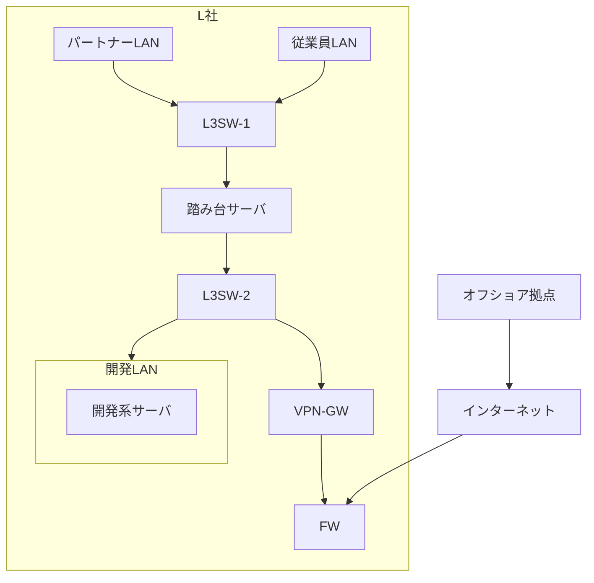
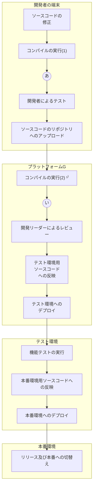

## 問1 サプライチェーンのリスク対策に関する次の記述を読んで、設問に答えよ。

L社は、金融業向けにシステムを開発している従業員 1,000名の企業である。L社のシステム開発プロジェクトでは、プラットフォームGというソフトウェア開発プラットフォームを利用している。プラットフォームGの機能には、ソースコード及び開発ドキュメントのバージョンを管理する機能, CI/CD パイプラインの管理機能,開発対象の SBOM 作成機能がある。CI/CD パイプラインの管理機能を利用してテストやリリースの自動実行が可能である。開発対象のSBOM 作成機能はプラットフォームG上のリポジトリサーバ内のソースコード及びライブラリをシステム構成要素として一覧化する。開発対象の SBOM 作成機能は現状では特に利用していない。また、L社が採用している SAST ツール(以下、ツールFという)は、プラットフォームG上のリポジトリサーバや開発者の端末にインストールして利用するツールであり、コンパイルエラーが解消されたソースコードに対してだけ正常な検査が可能である。プラットフォームGのCI/CD パイプラインの管理機能で、ツールFでのチェックを自動的に行うようなワークフローを構成することができる。

近年,業務委託先でのセキュリティ侵害に起因する情報セキュリティインシデントが大きく報道されるなど外部環境が変化し、L社経営陣もサプライチェーンリスク対策の強化を考えるようになった。経営陣の指示で、情報セキュリティ担当のBさんは、サプライチェーンリスク対策を強化したセキュリティガイドライン(以下、ガイドラインという)を作成し、全てのシステム開発プロジェクト及び運用サービスを点検することになった。Bさんは、L社が契約しているセキュリティコンサルタントで情報処理安全確保支援士(登録セキスペ) のD氏にガイドラインの作成について相談することにした。

### 〔ガイドラインの作成]

次は、ガイドラインの作成についてのBさんとD氏の会話である。

**Bさん:** ガイドラインはどのような構成がよいでしょうか。

**D氏:** システムライフサイクルの工程に合わせるのがよいでしょう。L社のシステム開発業務を踏まえて、調達,開発、リリース・デプロイ,運用の工程に分類し、さらに全ての工程で共通するような項目も抜き出して記載しましょう。

Bさんは、ガイドライン案を表1のように作成した。

**表1 ガイドライン案(抜粋)**

| 工程 | 項番 | 対策 |
| :--- | :--- | :--- |
| 共通 | 1 | システムに関連する情報資産を、業務委託先と共同で利用するものも含めて一覧化し、管理すること。一覧化すべき情報資産は、次のとおりである。 ・サーバ ・ネットワーク機器 ・ソースコード ・リポジトリ内のライブラリ |
| | 2 | 各工程で利用するシステムのアカウントは、業務委託先を含めて必要な利用者にだけ発行すること。その際、責任追跡性を確保するためにアカウントの利用者を特定できるようにすること |
| | 3 | 一覧化した情報資産ごとに、パッチ適用状況など最新の構成情報を把握すること |
| 調達 | 4 | 業務委託先の企業を、再委託先まで含めて一覧として管理すること |
| | 5 | 業務委託先でのセキュリティ管理に関する要件を、業務委託先との契約に含めること |
| 開発 | 6 | ソフトウェア開発プラットフォームなどの開発環境は、アクセス制御を行い、必要な利用者だけがアクセスできるようにすること |
| | 7 | 開発環境にアクセスしたアカウントを特定できるようにアクセスログを記録すること |
| | 8 | 開発したソフトウェアのソースコードは、人手によるレビュー及びSASTツールによるチェックを行うこと |
| | 9 | システムの仕様、機能を精査し、不要な機能やセキュリティ上の欠陥がないことを設計書から確認すること |
| リリース・ デプロイ | 10 | 開発したソフトウェアのSBOMを作成すること |
| | 11 | リリースしたソフトウェアは、リリースバージョンを管理すること |
| 運用 | 12 | システムの稼働環境において、稼働状況を監視すること |
| | 13 | システムの稼働環境において、要件に応じたアクセス制御を実施すること |
| | 14 | システムの運用端末がある部屋は、要件に応じた入退室管理を実施すること |
| | 15 | インシデント対応手順書を作成すること |

次は、ガイドライン案についてのBさんとD氏の会話である。

**Bさん:** ①<u>セキュリティ・バイ・デザインの考え方を一部取り入れました。</u>その他、留意すべき点などはありますか。

**D氏:** 項番5には、②<u>業務委託先が再委託を行う場合に備えて、L社と業務委託先との間の契約書に明記すべき事項</u>を具体的に示しておくとよいでしょう。

Bさんが修正したガイドライン案を経営陣に報告したところ、過去に外部ベンダーでのセキュリティ侵害に起因してL社でインシデントが何度か発生したことがあったので、それらのインシデントに対するガイドライン案の有効性を評価するように指示があった。

### [過去のインシデントの確認〕

Bさんは、過去のインシデントに対するガイドライン案の有効性を評価することにした。次は、1件目のインシデントについてのD氏とBさんの会話である。

**D氏:** はじめに、インシデントの内容を確認しておきましょう。

**Bさん:** L社が開発し、運用していたシステム(以下、システムという)では、古い Web ブラウザをサポートするための JavaScript (以下、スクリプトPという)を利用していました。スクリプトPは、当時広く使われていたT社製のものでした。スクリプトPは、T社が運営するサーバ (以下、サーバTという)に配置され、システムにアクセスした Web ブラウザがスクリプトPを都度読み込むようにシステムは構成されていました。ある日、サーバTが乗っ取られてしまい、スクリプトPが改ざんされたことによって、システムへの利用者のアクセスが悪意のある Web サイトにリダイレクトされてしまいました。

**D氏:** 発見の経緯を教えてください。

**Bさん:** システムの利用者からの問合せで気付き、対策を実施しました。当時の情報セキュリティ担当は、サーバTが侵害されたというニュースは知っていましたが、システムQへのアクセスが影響を受けることを把握していませんでした。

**D氏:** 他社の発表によると、③<u>スクリプトPを利用していたシステムでもスクリプトPの配置方法が違えば、影響を受けなかったようですね。</u>

**Bさん:** はい。違う配置方法にするという対策もありました。しかし、Web ブラウザ開発元での古い Web ブラウザの公式サポートが終了していたことから、当社の対策としては、④<u>システムのソースコードに変更を加えて、古い Web ブラウザのサポートを終了しました。</u>

**D氏:** 1件目のインシデントについてはおおむね理解できました。

**Bさん:** 案の項番10が、1件目のインシデントを未然に防ぐために有効ではありませんか。

**D氏:** いいえ、開発対象のSBOM 作成機能でSBOMを作成していたとしても、スクリプトPはSBOMに含まれないので、インシデントは防げなかったでしょう。

Bさんは、⑤<u>SBOM 以外の手段で、システムが利用している外部のスクリプトを把握できるよう、案の項目を一つ修正した。</u>D氏とともに、そのほかの過去のインシデントについても案を評価したところ、案は有効であると確認できたので、経営陣に報告して承認を得た。

### [ガイドラインを用いた点検の実施〕

ガイドラインを用いて、現在進行中の全てのシステム開発プロジェクト及び運用サービスを点検することになった。最初の点検対象は、システムSの開発プロジェクト及び運用サービスである。Bさんがプロジェクト計画書、運用計画書などからまとめたシステムSの開発プロジェクト及び運用サービスの概要を図1に、開発環境の構成図を図2に示す。

**図1 システムSの開発プロジェクト及び運用サービスの概要**

1.  システムSは、L社が3年前からS銀行向けに提供しているインターネットバンキングシステムである。運用と追加機能の開発をL社が請け負っている。
2.  セキュリティ監視を情報セキュリティ会社のN社に委託している。開発は、L社従業員、L社に派遣された派遣エンジニア及び他の業務委託先の従業員が行っている。なお、運用ツールなど一部のソフトウェアはN社が開発することがある。
3.  L社がシステムSを運用するためにS銀行内にセキュアルームが用意されている。セキュアルームへの入室にS銀行が貸与するカードでの認証を必須とする入退室装置が導入され、S銀行の管理者及びL社の運用担当者しか入室できないようになっている。
4.  派遣元及び業務委託先との間では、L社のセキュリティポリシーの順守とプロジェクトでのセキュリティルールの順守について契約書で定めている。N社との業務委託契約には、N社内のセキュリティ管理についての実施事項及びN社が再委託を行わないことを明記している。N社での委託契約の順守状況を定期的な監査によって確認する。
5.  開発時に、要件定義段階での脅威モデリング及び設計段階での設計書の確認を行い、不要な機能やセキュリティ上の欠陥がないことを確認する。
6.  プラットフォームGに設計書を格納する。開発したソフトウェアのSBOMは作成しない。
7.  開発したソフトウェアのソースコードは、開発リーダーがレビューして承認する。開発したソフトウェアをリリースする際は、開発リーダーがリリースバージョンを更新する。
8.  資産管理台帳にサーバ及びネットワーク機器の一覧を担当者が入力する。
9.  システムSに組み込む OSS ライブラリは、開発者が取得する。OSSライブラリは資産管理台帳に入力しない。
10. 開発は、L社内及びオフショア拠点で行い、次のLANに接続した端末で実施する。
      * L社内に用意した従業員 LAN
      * L社内に用意したパートナーLAN
      * オフショア拠点にある業務委託先のLAN
        また、テストなどのためにシステムSの開発系サーバがある LAN (以下、開発 LAN という)にアクセスする際には一旦、踏み台サーバにログインする。踏み台サーバには、L社、業務委託先など会社ごとに発行した共用アカウントでログインするが、ログインごとに、利用記録簿に記載する。開発 LAN 上のサーバには製品仕様上、アクセスログが取れないものもある。
11. インシデント発生時にL社のシステムSの担当者に連絡するための業務フローがインシデント対応手順書に定められており、システムSの担当者がインシデントのハンドリングを行う。
12. ツールFが開発者の端末とプラットフォームGにインストールされている。

**図2 システムSの開発環境の構成図 (抜粋)**
*L3SW: レイヤー3スイッチ*
*FW: ファイアウォール*
*VPN-GW: VPNゲートウェイ*

Bさんは、システムSの担当者へのヒアリング前に論点を整理しておこうと考え、表1の各項番について、図1に基づき、対策状況を確認した。結果は表2のとおりである。

**表2 システムSの事前確認結果(抜粋)**

| 工程 | 表1の項番 | 確認した図1の項番 | 確認結果又は問題点 |
| :--- | :--- | :--- | :--- |
| 共通 | 1 | 8,9 | OSS ライブラリを台帳管理していない。 |
| | 2 | ア | a |
| 調達 | 5 | イ | 問題なし |
| 開発 | 9 | ウ | b |
| リリース・ デプロイ | 10 | 6 | 開発したソフトウェアについて SBOM を作成していない。 |
| 運用 | 15 | エ | c |

Bさんは、システムSの担当者であるCさんにヒアリングを行った。

### 〔SBOM についての確認〕

次は、表1の項番10についてのCさんとBさんの会話である。

**Cさん:** システム Sのソフトウェア構成は設計書で把握できると考えていますが、SBOM の作成も必要でしょうか。

**Bさん:** SBOM を利用すると、⑥<u>将来,脆弱性管理がしやすくなります。</u>プラットフォームGで作成することができます。

**Cさん:** なるほど。それでは、SBOMの作成を検討します。

### 〔開発工程のセキュリティ対策についての確認〕

Bさんは、表1の項番7,8について確認した。次は、そのときのBさんとCさんの会話である。

**Bさん:** 表1の項番7の対策は実施できていますか。

**Cさん:** オフショア拠点から開発 LAN へのアクセスについてはVPN-GWでアクセスログを取得できているものの、社内からのアクセスについては取得できていません。

**Bさん:** アクセスログは図2中の d で取得するのがよいでしょう。

**Cさん:** 分かりました。

**Bさん:** 表1の項番8の対策はどのようにしていますか。

**Cさん:** 現在はソースコードの変更内容を開発リーダーがレビューしています。

**Bさん:** 開発リーダーによるレビューに加えて、ツールFでチェックするのがよいでしょう。

**Cさん:** 開発フローのどこでツールFを実行するのがよいでしょうか。

**Bさん:** ツールFの特性を踏まえると、図3のシステムSの開発フロー中の(あ)又は(い)で実行するのがよいと考えられます。⑦<u>それぞれ利点が異なります。</u>

**図3 システムSの開発フロー**
*注1) 複数の開発者が変更した内容を反映させた上でコンパイルエラーが出ないことを確認している。*

ガイドラインを用いた点検の後、L社のサプライチェーンリスク対策は強化された。

### 設問1

[ガイドラインの作成] について答えよ。
(1) 本文中の下線①について、どのような考え方か答えよ。
(2) 本文中の下線②について、明記すべき事項を、50字以内で答えよ。

### 設問2

[過去のインシデントの確認] について答えよ。
(1) 本文中の下線③について、影響を受けない配置方法を答えよ。
(2) 本文中の下線④について、加えた変更を、具体的に答えよ。
(3) 本文中の下線⑤について、修正した項番と修正内容を答えよ。

### 設問3

[ガイドラインを用いた点検の実施〕 について答えよ。
(1) 表2中の ア ～ エ に入れる適切な項番を答えよ。
(2) 表2中の a ～ c に入れる適切な字句を答えよ。

### 設問4

本文中の下線⑥について、脆弱性管理がしやすくなる理由を、具体的に答えよ。

### 設問5

〔開発工程のセキュリティ対策についての確認 について答えよ。
(1) 本文中の d に入れる適切な字句を、図2中の名称で答えよ。
(2) 本文中の下線⑦について、(あ), (い)で実行する利点を、それぞれ40字以内で答えよ。