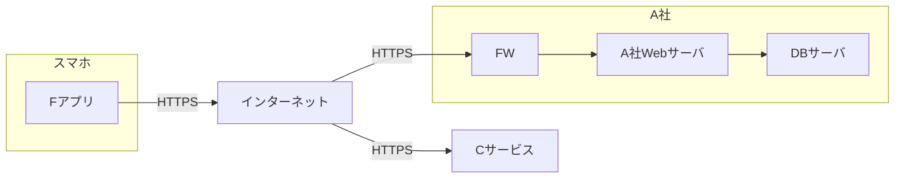
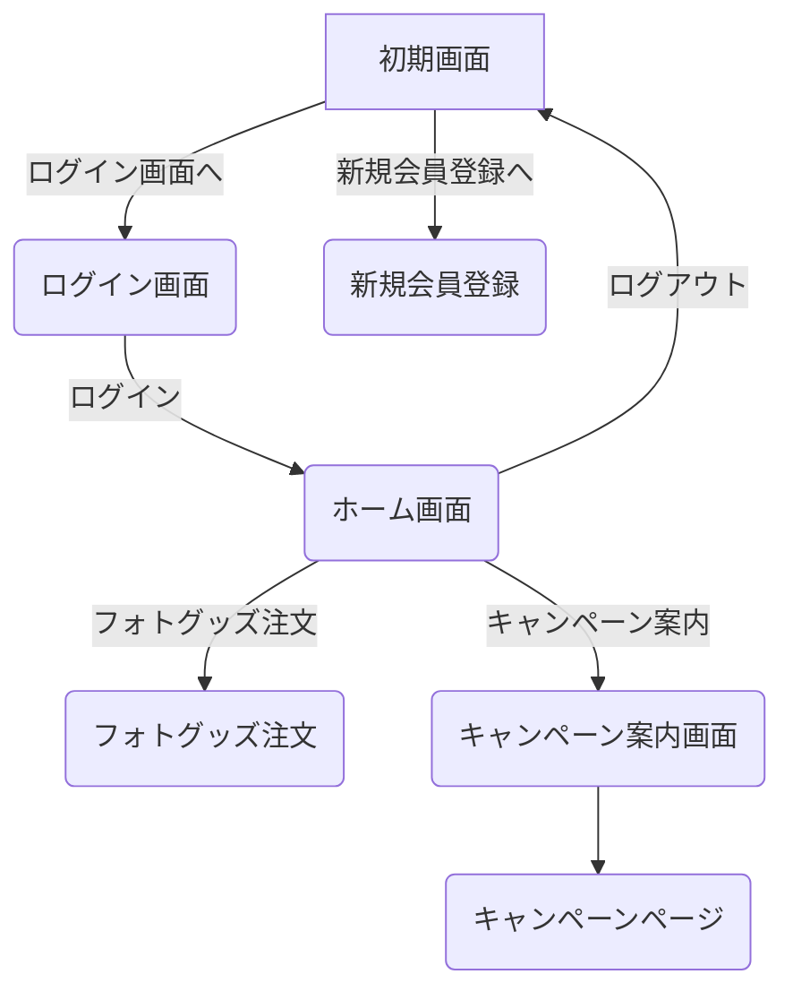
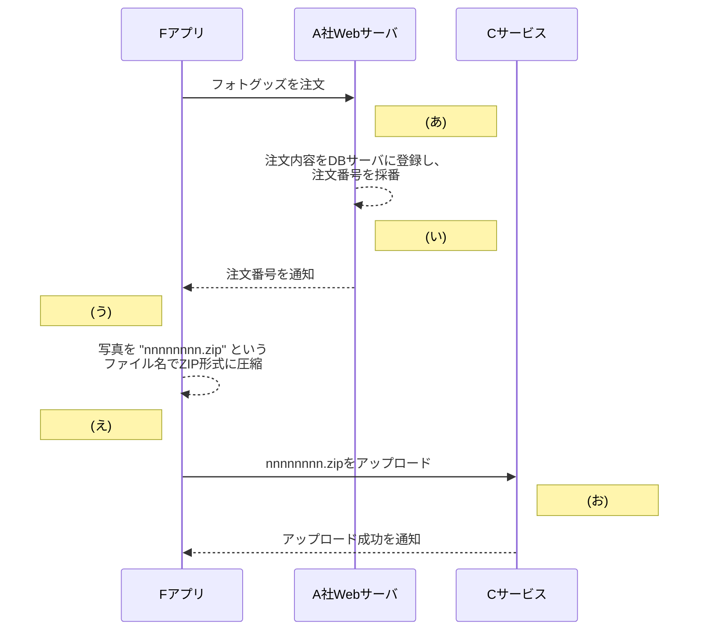

## 問3 スマートフォン用アプリケーションプログラムの開発に関する次の記述を読んで、設問に答えよ。

A社は、撮影機器の販売や写真のプリントサービスを全国に200店舗で展開する従業員2,000名の企業である。実店舗の運営に加え、インターネットを介して撮影機器の販売を行う ECサイト事業を有している。このたび、会員がスマートフォン(以下、スマホという) 用アプリケーションプログラム(以下、スマホ用アプリケーションプログラムをスマホアプリという)を通じて、写真入りのカレンダーなどのグッズ(以下、フォトグッズという)を注文できるサービス(以下, E サービスという)を新規に開始することになった。Eサービス用スマホアプリ (以下、Fアプリという)は国内で流通する主要なスマホOSであるOS-αとOS-βの過去5年以内に正式リリースされたバージョンをサポートする。

### [Eサービスの説明]

E サービスは、Fアプリとサーバサイドのシステム群で構成される。Fアプリは、インターネットを介してEサービス用 Web サーバ (以下、A社 Web サーバといい、 FQDN は www.a-sha.co.jpとする) 及び大手クラウドサービスプロバイダC社のクラウドストレージサービス(以下,Cサービスという)との間でHTTPS を使用して通信する。フォトグッズの作成に使う写真は、FアプリからCサービスにアップロードする。 Eサービスのネットワーク構成を図1に、機能概要を図2に、Fアプリの画面構成を図3に、フォトグッズの注文処理の流れを図4に、Cサービスの仕様を図5に示す。

**図1 Eサービスのネットワーク構成(概要)**
*FW: ファイアウォール DBサーバ: データベースサーバ*



**図2 Eサービスの機能概要(抜粋)**

1.  **新規会員登録機能**
    Eサービスを利用するための新規会員登録を行う。
2.  **ログイン機能**
    会員IDとパスワードでログインする。ログインした会員には、認証トークンが払い出され、ログアウトするまでの間、Fアプリに保存される。認証トークンは、A社 Web サーバ上で会員のセッションを識別するために使用する推測困難な値である。
3.  **フォトグッズ注文機能**
    Fアプリ上でフォトグッズを注文する。ログイン済み会員だけが利用できる。
    なお、フォトグッズは、指定したA社の実店舗で受け取ることができる。
4.  **キャンペーン案内機能**
    キャンペーンのWebページ(以下、キャンペーンページという)を表示する。ログイン済み会員だけが利用できる。
    なお、キャンペーンに応募することによって、フォトグッズの割引などに利用可能なクーポンを入手できる。会員には、電子メール(以下、メールという)などを通じて、期間限定のキャンペーンを案内する。キャンペーンの内容は、2週間ごとに更新される。

*注) 認証トークンは、ログイン後にFアプリがA社WebサーバにHTTP リクエストを送信する際, Authorization ヘッダーに指定される。*

**図3 Fアプリの画面構成 (抜粋)**
*→: ボタンが押下されたときの画面遷移*
*-->: 適切な値を入力してボタンが押下されたときの画面遷移*
*注記 キャンペーンページはHTML形式で作成し、A社Webサーバにアップロードしておく。*



**図4 フォトグッズの注文処理の流れ**
*注記 “nnnnnnnn” は注文番号であり、00000001 から始まる十進数の連番である。*



**図5 Cサービスの仕様 (抜粋)**

1.  **サービスの概要**
    (1) Cサービスはマルチテナントのストレージサービスである。テナントの管理権限をもつ利用者(以下,管理者という)が作成したストレージに対し、テナントの作成したシステム(以下,利用システムという)からファイルのアップロードやダウンロード(以下、アップロード、ダウンロードを併せてファイル操作という)を行う。
    (2) 管理者は、ストレージの作成時に任意のストレージ名を設定する。ストレージを作成すると、Cサービスからアクセスキーが発行される。アクセスキーはストレージごとに異なる40字の英数字である。
    (3) 利用システムは、ストレージ上のファイルを URL のパスで指定する。例えば、ストレージ“●●●”上のファイル "▲▲▲ をファイル操作する際は、“/●●●/▲▲▲ を指定する。ファイルのアップロードにはHTTPのPUT メソッドを、ファイルのダウンロードにはGET メソッドを用いる。
    (4) 利用システムは、次の方式a又は方式bでファイル操作を行う。

2.  **方式 a**
    (1) **説明**
    アクセスキーをHTTP リクエストの Authorization ヘッダーに指定する方式である。利用システムは、Cサービスから発行されたアクセスキーを用いることによって、アクセスキーに対応するストレージに格納された全てのファイルに対するファイル操作が可能となる。 Authorization ヘッダーに正しいアクセスキーが指定されていない場合、ファイル操作は拒否される。
    (2) **使用例**
    アクセスキー“○○○”を指定して、ストレージ “abc” 上のファイル "xyz” をダウンロードする際に送信する HTTP リクエストの例を次に示す。

    ```
    リクエストライン: GET /abc/xyz HTTP/1.1
    ヘッダーフィールド: Host: storage.c-sha.jp
                     Authorization: Bearer ○○○
    ```

3.  **方式 b**
    (1) **説明**
    有効期限(Expires) と署名値 (Signature) をクエリパラメータとして付加したURL (以下、署名付き URL という)を用いて、特定のファイルに対するファイル操作を一時的に可能とする方式である。ここで、Expires パラメータに指定する有効期限は UNIX タイムスタンプ形式である。署名値の生成は次のように行う。
    (i) GET 又は PUT から始まり、パス中の “/●●●/▲▲▲?Expires=【有効期限】”で終わる文字列を署名対象文字列とする。
    (ii) アクセスキーを秘密鍵とする。
    (iii) 署名対象文字列と秘密鍵から HMAC-SHA256値を求める。
    (iv) (iii)で求めた値を base64url エンコードする。
    利用システムは、署名付き URL を生成し、ファイル操作を許可する利用者に伝える。伝えられた利用者は、署名付きURLを指定してHTTPリクエストを送ることによって、ファイル操作ができる。有効期限が切れた場合やサーバ側で署名値の検証が失敗した場合は、ファイル操作が拒否される。
    (2) **使用例**
    ストレージ “abc” 上のファイル “xyz” をダウンロードする場合で、かつ、署名値が“△△△” の場合のHTTP リクエストの例を次に示す。xyzは、日本時間の2025年5月30日0時0分0秒、つまり UNIX タイムスタンプで1748530800までの間、ダウンロードが許可されている。

    ```
    リクエストライン: GET /abc/xyz?Expires=1748530800&Signature=△△△ HTTP/1.1
    ヘッダーフィールド: Host: storage.c-sha.jp
    ```

Eサービスで使うCサービスのストレージ名は、e-service である。Fアプリでは、方式aを利用する。アクセスキーは、鍵長256ビットの共通鍵と AES-CBC アルゴリズムで暗号化し、Fアプリ内にリソースとして保存する。Cサービスのストレージ名並びに AES-CBC の共通鍵及び初期ベクトルは、Fアプリのコード中に定数として定義する。

### [キャンペーン案内機能の実装方法]

F アプリでのキャンペーンページの表示には、WebView という仕組みを用いる。 WebViewは、スマホOSの提供する仕組みであり、スマホアプリの画面の一部にWebページを表示させることができる。キャンペーンページのHTMLは、WebViewを用いて、Fアプリの画面上に表示させる。

会員に送るキャンペーン案内のメール本文中には、Fアプリでキャンペーンページを表示するためのURL (以下、F-URL という)を含める。会員がメールアプリから F-URL を開くと、Fアプリが起動し、WebView 上にキャンペーンページが表示される。キャンペーンページからキャンペーンに応募する際の会員のセッションの識別には、F アプリに保存されている認証トークンを用いる。OS-αでは、キャンペーンページが表示された後に、WebView の機能によってキャンペーンページ上の ECMAScript コードがFアプリの getToken 関数を呼び出す。これによって、認証トークンがFアプリからキャンペーンページに引き渡される。OS-βでは別の方式で同様の機能を実現する。キャンペーンページ上の ECMAScript コードを図6に示す。

**図6 キャンペーンページ上の ECMAScript コード**

```javascript
const token = f_app.getToken();
```

キャンペーンページ以外から getToken 関数を悪用されないように、getToken 関数の内部では、図7のように呼出し元の Web ページのURLを確認する。

**図7 getToken 関数の処理の流れ**

```mermaid
graph TD
    Start((開始)) --> Cond{呼出し元のWebページのURLの先頭は<br>"https://www.a-sha.co.jp" か。}
    Cond -- Yes --> Proc1[認証トークンを返す。]
    Cond -- No --> Proc2[空文字列、つまり長さ0の<br>文字列を返す。]
    Proc1 --> End((終了))
    Proc2 --> End((終了))
```

F-URL の例を図8に示す。

**図8 F-URLの例**
*注記1 “f-app” はカスタム URL スキームである。*
*注記2 “□□□”はキャンペーンページのURLのパスである。*

```
f-app://campaign?url=https://www.a-sha.co.jp/campaign/□□□
```

### [Fアプリの脆弱性診断結果]

A社は、セキュリティ専門会社のD社に依頼してFアプリの脆弱性診断を実施した。その結果、表1に示す脆弱性が検出された。

**表1 脆弱性診断結果(抜粋)**

| 脆弱性 | 脆弱性の概要 | 解説 |
| :--- | :--- | :--- |
| 1 | サーバ証明書の検証不備がある。 | Fアプリは、HTTPS でサーバと接続する際、サーバ証明書の検証エラーがあっても無視し、通信を続行する。そのため、HTTPS 通信の内容が盗聴されたり、改ざんされたりするおそれがある。盗聴されると、①<u>盗聴した内容からアクセスキーとストレージ名を攻撃者が取得するおそれがある。</u> (省略) |
| 2 | C サービスのアク セスキーの保護に 不備がある。 | ②<u>攻撃者がFアプリから平文のアクセスキーとストレージ名を取得できる。</u>そのアクセスキーを用いて、③<u>攻撃者がEサービスの全利用者の写真を不正にダウンロードするおそれがある。</u> (省略) |
| 3 | F-URL の処理にアクセス制御の不備がある。 | F-URLのurl クエリパラメータに、④<u>細工したURL が指定される</u>ことによって、攻撃者の Web サイトにアクセスしてしまうおそれがある。また、攻撃者が会員の認証トークンを取得するおそれがある。 (省略) |

#### [脆弱性1]

Fアプリの開発チームに所属するUさんは、D社のSさんが開催する診断結果報告会に参加した。

Uさんは、脆弱性1が作り込まれた経緯を説明した。Uさんによると、FアプリとA社 Web サーバとの間の通信内容に異常がないかどうかを調査するために、開発用 PC で通信解析ツールを利用した。この通信解析ツールはプロキシサーバとして動作する。このツールを利用すると、Fアプリでは、サーバ証明書の検証エラーが発生し、FアプリとA社 Web サーバとの間の通信が中断されてしまった。そこで、インターネット上のある記事でエラーが発生しても通信を続行する方法が紹介されていたのを参考にして、Fアプリのコードを変更したということであった。

この通信解析ツールを利用し、“[https://www.a-sha.co.jp/campaign/](https://www.a-sha.co.jp/campaign/)□□□”にアクセスした際のレイヤー4~7の通信フローの例を図9に示す。

**図9 通信解析ツールを利用した際の通信フローの例(抜粋)**
*注記 通信解析ツールのプライベートIPアドレスは、○○○.○○○.○○○.○○○とする。*
*注 通信解析ツールは、自身のプライベート認証局機能を用いる。*

```mermaid
sequenceDiagram
    participant スマホ
    participant 通信解析ツール
    participant A社Webサーバ

    スマホ->>通信解析ツール: TCPの3ウェイハンドシェイク
    通信解析ツール->>スマホ: a を送信
    スマホ->>通信解析ツール: b を送信
    通信解析ツール->>スマホ: c を送信
    note over 通信解析ツール: ⑤サーバ証明書を生成
    box rgba(0, 0, 255, 0.1) TLS ハンドシェイク
    通信解析ツール->>スマホ: 次の順にまとめて送信<br>(1) d<br>(2) Encrypted Extensions<br>(3) e<br>(4) f<br>(5) g
    スマホ->>通信解析ツール: g を送信
    通信解析ツール->>スマホ: h を送信
    end
    通信解析ツール->>A社Webサーバ: TCPの3ウェイハンドシェイク
    通信解析ツール->>A社Webサーバ: 左記のTLSハンドシェイクと同様のフロー
    A社Webサーバ->>通信解析ツール: h を送信
    A社Webサーバ->>通信解析ツール: b を送信
    通信解析ツール->>スマホ: b を送信
```

Uさんは、通信解析ツールを利用してテストを行う際も通信を正常に続行させる方法をチーム内で話し合った。その結果、今後、開発用のスマホに⑥<u>必要な設定を行う</u>ことにした。加えて、OS-αではテストを行う際だけその設定を有効化するように、Fアプリの中にも設定を追加した。

#### [脆弱性2]

脆弱性2への対応について、Sさんからは方式bを利用し、その際に署名付き URL の生成を図4中の <span style="display:inline-block; border: 1px solid black; padding: 0 10px; text-align: center;">i</span> の時点で行ってはどうかとの提案があった。UさんはSさんの提案を了承した。

#### [脆弱性3]

次は、脆弱性3についてのUさんとSさんの会話である。
**Uさん:** 対策として、図7の処理を修正します。
**Sさん:** 図7の処理を修正すれば、認証トークンを盗まれるリスクは回避できます。しかし、Web ブラウザと比べると、⑦<u>フィッシングサイトにアクセスしてしまっても気付くことができない</u>というFアプリの仕様上の問題点が残ります。フィッシングサイトに気付くことができるようにするための機能か、そもそもフィッシングサイトにアクセスできないようにする機能が必要です。
**Uさん:** はい。図7の処理の修正に加えて、⑧<u>フィッシングサイトにアクセスできないようにする機能</u>を実装します。

A社は、検出された脆弱性を修正し、Eサービスの提供を開始した。

### 設問1

[Fアプリの脆弱性診断結果] について答えよ。
(1) 表1中の下線①について、アクセスキーを取得する方法を、具体的に答えよ。
(2) 表1中の下線②について、アクセスキーを取得する方法を、具体的に答えよ。
(3) 表1中の下線③について、ダウンロードする方法を、具体的に答えよ。
(4) 表1中の下線④について、攻撃者の Web サイトにアクセスさせることができるように細工したURLの例を、攻撃者が取得したドメイン名を k-sha.co.jp とした場合で答えよ。

### 設問2

〔脆弱性1〕 について答えよ。
(1) 図9中の下線⑤について、サーバ証明書の Subject Alternative Name の値を、具体的に答えよ。
(2) 図9中の <span style="display:inline-block; border: 1px solid black; padding: 0 10px; text-align: center;">a</span> ～ <span style="display:inline-block; border: 1px solid black; padding: 0 10px; text-align: center;">h</span> に入れる適切な字句を、解答群の中から選び、記号で答えよ。

**解答群**
ア Certificate
イ Certificate Verify
ウ Client Hello
エ CONNECT ○○○.○○○.○○○.○○○:443 HTTP/1.1
オ CONNECT www.a-sha.co.jp:443 HTTP/1.1
カ Finished
キ GET /campaign/□□□ HTTP/1.1
ク HTTP ステータスコード 101 (Switching Protocols)
ケ HTTP ステータスコード 200 (OK)
コ Server Hello

(3) 本文中の下線⑥について、設定の内容を、具体的に答えよ。

### 設問3

本文中の <span style="display:inline-block; border: 1px solid black; padding: 0 10px; text-align: center;">i</span> に入れる記号を、図4中の(あ)～(お)から選び、答えよ。

### 設問4

[脆弱性3] について答えよ。
(1) 本文中の下線⑦について、問題点を 20字以内で答えよ。
(2) 本文中の下線⑧について、実装する機能を、具体的に答えよ。