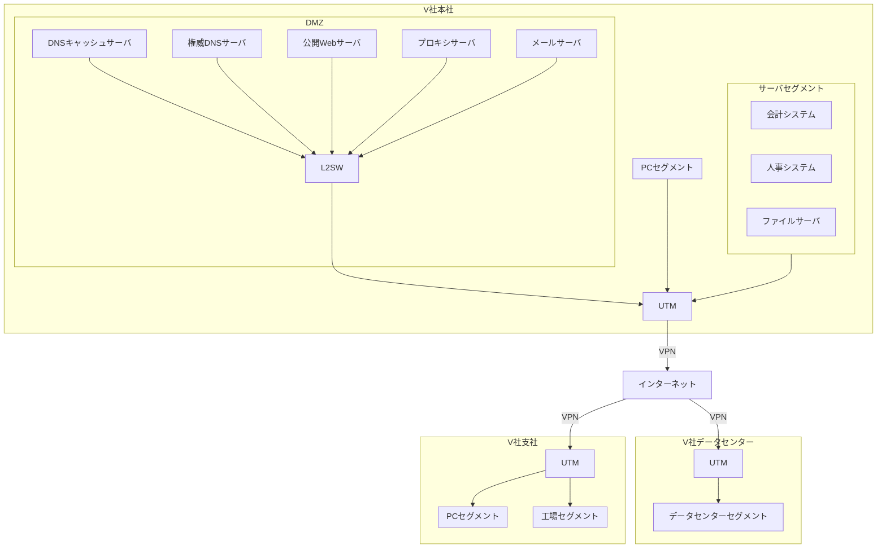

## 問4 IT資産管理及び脆弱性管理に関する次の記述を読んで、設問に答えよ。

V社は、従業員3,000名の製造業である。東京に本社,大阪,名古屋、福岡に支社がある。V社は、J事業部,K事業部 情報システム部(以下,情シ部という)、総務部、経理部などから成る。

V社の社内システム及びネットワークの運用並びに情報セキュリティ管理は、情シ部のB部長とS主任を含む8名の部員が担当している。V社のネットワーク構成を図1に示す。

**図1 V社のネットワーク構成**
*L2SW: レイヤー2スイッチ*
*メール: 電子メール*
*UTM: 統合脅威管理*

公開 Web サーバでは、V社製品のキャンペーンなどを紹介している。V社本社と各支社及びV社データセンターの間はUTMのVPN 機能を使用して通信を行っている。各支社には、UTMを除いてインターネットからアクセス可能なIT機器はない。

V社のIT資産管理、ドメイン名及びIPアドレスの管理、導入ソフトウェア(以下,ソフトウェアをSWという)の管理並びに脆弱性管理の現状を表1に示す。

**表1 V社のIT資産管理、ドメイン名及びIPアドレスの管理,導入SWの管理並びに脆弱性管理の現状**

| 項目 | 状況 |
| :--- | :--- |
| **IT資産管理** | 1. IT資産管理台帳に対して、IT資産の登録、更新及び削除を行う 2. IT資産管理台帳は、全社で共有されている 3. インターネットからアクセス可能な全てのIT資産を公開 IT資産と定義する。 4. IT資産管理台帳の管理項目には、資産ID、資産名称,取得金額,管理部門名,管理者名,公開 IT 資産かどうかの区分、及びその他特記事項を含める。また公開 IT資産の場合はグローバルIPアドレス(以下, GIP という)¹⁾及びドメイン名も含める。 5. IT資産管理台帳への登録は次のように行っている  (1) 情シ部が購入する IT資産は、情シ部がIT資産管理台帳に登録する  (2) 事業部がV社データセンター又はV社DMZにサーバを設置する場合は、情シ部に設置申請し、承認を得た後に設置する。情シ部は承認後IT資産管理台帳に登録する。  (3) 事業部が他社データセンター、クラウドサービス又はレンタルサービスを契約して、サーバなどを利用する場合については、IT資産管理台帳に登録していない。 6. IT資産は、年1回の棚卸しで管理部門が現物確認する。その際に、管理部門がIT資産管理台帳を更新する。IT資産の廃棄は管理部門が実施し、その際に、管理部門がIT資産管理台帳を更新する。 |
| **ドメイン名及び IP アドレスの管理** | 1. V社データセンター及びV社本社で使用するIPアドレス及びドメイン名の管理は、次のように行っている。  (1) 情シ部が、“v-sha.co.jp” というドメイン名 (以下、V社のドメイン名という)をレジストラのW社から取得し、V社データセンター、V社DMZなどにある公開IT資産に使用している。ドメイン名の使用料は情シ部が支払っている。JPRSが管理しているドメイン名の登録者情報の組織名にV社を、担当者情報の部署名に情シ部を、担当者名にS主任を登録している  (2) GIP は、 ISPのR社から割り当てられている。GIPの使用料は、情シ部が回線使用料と併せてR社に支払っている。JPNICの登録者情報の組織名にV社を、担当者情報の部署名に情シ部を、担当者名にS主任を登録している。  (3) 事業部がV社データセンター又はV社 DMZ にサーバなどを設置する場合は、情シ部にIPアドレス使用申請を行う  (4) 事業部がV社のドメイン名を使用する場合は、情シ部にドメイン使用申請を行う。この際、情シ部は、必要なDNSレコードを登録している。 2. 事業部が他社データセンター、クラウドサービス又はレンタルサービスを契約し、新たなドメイン名を登録してサーバを利用する場合は、次のように行っている。  (1) GIPは、各サービス会社から割り当てられたものを使用している  (2) ドメイン名は、各事業部が取得している。なお、使用するドメイン名は全て、トップレベルドメインが“.jp” のドメインを使用している |
| **導入 SWの管理** | 1. PCに導入する SWは、IT資産管理ツール(以下、AMツールという)で管理しており、IT資産管理台帳には登録せず、PCの“資産 ID”をAM ツールに入力して管理している 2. ビジネス上、重要なサーバに導入する SWは、AM ツールで管理している。ビジネス上、重要ではないサーバに導入する SWは、主なものを IT資産管理台帳の“その他特記事項”に記入している。 |
| **脆弱性管理** | 1. サーバに導入したSWの脆弱性情報は、情シ部が脆弱性のニュースを毎日見て確認している。 2. 情シ部が、脆弱性のニュースで話題になった脆弱性情報全てを全部門に連絡している。 3. 連絡を受けた各部門が取捨選択し、必要に応じて対応している。 |
*注1) インターネットから当該IT資産にアクセスする時のGIPである。*

最近、次のようなサイバー攻撃のニュースが報道された。
(1) CVE-20XX-XXXXX という Web サーバでの通信の暗号化に関する脆弱性が公表され、それを悪用した攻撃で、ある広告代理店に大きな被害が発生した。
(2) 著名な会社が1年前、CDN事業者のサービスを利用してWebサーバを立ち上げ、1 か月間商品のキャンペーンを行った。この Web サーバには、その会社のサブドメインを使用した。キャンペーン後すぐに、CDN サービスを解約したが、今になって、そのサブドメインが海外の会社の広告サイトとして使われていることが発覚した。
(3) 競合他社で、不要になったにもかかわらず公開されたままとなっていた Web サーバが改ざんされ、フィッシングに悪用されていることが発覚した。

これらを受けて、V社の経営層は、V社でも対策が必要だと考え、対策の検討と実施を情シ部に指示した。(2)については、V社でも、CDN事業者のサービスを利用して Web サーバを立ち上げてキャンペーンを行った後、CDN サービスを解約した経緯があったので、緊急に確認した。その結果、問題があることが分かり、①<u>図1中のサーバの設定を変更した。</u>この事態も踏まえて、公開 IT 資産管理及び脆弱性管理を見直すことにした。

### 〔公開IT資産管理及び脆弱性管理の目標の設定〕

情シ部のB部長とS主任は、まず、公開IT資産管理の現状を分析し、公開IT資産管理及び脆弱性管理の主な目標を表2にまとめた。

**表2 公開 IT資産管理及び脆弱性管理の主な目標(抜粋)**

| 目標 | 内容 | ケースの |
| :--- | :--- | :--- |
| K-1 | IT 資產管理台帳に公開 IT 資産を漏れなく登録する。具体的には、次のような登録漏れをなくす。 (1) 事業部がクラウドサービスを契約して利用している公開 IT資産 | |
| | (省略) | |
| K-2 | 情シ部が、サーバの導入 SWを一元管理する | |
| K-3 | 重要な脆弱性を事業部が修正したかどうかを情シ部が確認できるようにする | |
| K-4 | 利用が終了した公開 IT資産について、必要な措置を漏れなく行う | |

### 〔目標K-1の実現]

まず、目標 K-1 について検討を行い、各事業部への未登録の公開 IT 資産の調査依頼を図2にまとめた。

**図2 事業部への調査依頼**
次の未登録の公開IT資産を調査し、その一覧を回答すること

  - クラウドサービスを契約して利用している公開 IT資産
  - a 公開IT資産
  - b 公開IT資産

次は、目標 K-1の実現に関するB部長とS主任の会話である。
**B部長:** 事業部への調査依頼だけでは漏れが出そうだ。情シ部としても調査すべきだが、どのような方法があるのか。
**S主任:** 自分でインターネットをスキャンする方法(以下、オンアクセス型という)と、既に外部に構築されているデータベースを検索する方法(以下,検索エンジン型という)があります。
**B部長:** どちらの方がよいだろうか。
**S主任:** オンアクセス型では他社の環境に負荷を与える可能性があります。また、スキャンするには時間が掛かります。今回は検索エンジン型を使用したいと思います。
**B 部長:** 分かった。検索エンジン型だと、具体的には、どのような方法があり、どのような情報が収集できるのかな。
**S主任:** まず、IP アドレスの割当て、ドメイン名の登録などに関する情報をレジストラ又はレジストリに問い合わせることができます。そのための標準プロトコルとして、 C が用意されており、RFC 3912 で定義されています。次に、Webブラウザから利用できるサービスには、無償のものとして、ドメインの検索サービス(以下, X サービスという)と、GIP の検索サービス(以下、Yサービスという)があります。その他、一部有償になりますが、Z サービスというサービスなどがあります。Xサービスで検索可能な情報を表3に、Yサービスで検索可能な情報を表4に、Zサービスで検索可能な情報を表5に示します。

**表3 Xサービスで検索可能な情報(抜粋)**
*注1) 検索キーワードとして入力した文字列が“組織名”とマッチした検索結果が全て得られる。*
*注2) 一部の“".jp” ドメインの場合だけ検索可能である。*
*注3) セカンダリ DNSなどが設置されている場合は、複数得られる。*
| 検索キーワード | 検索可能な情報 |
| :--- | :--- |
| 組織名¹⁾ | 登録されているドメイン名 |
| ドメイン名 | 組織名、ドメイン名の担当者識別番号²⁾、ドメイン名を管理するネームサーバ名³⁾、登録年月日,接続年月日,最終更新日時など |
| ネームサーバ名 | ネームサーバのIPアドレス、登録年月日,最終更新日時など |
| ドメイン名の担当者識別番号²⁾ | ドメイン名の担当者名、メールアドレス、ドメイン名の部署名、電話番号など |

**表4 Yサービスで検索可能な情報 (抜粋)**
| 検索キーワード | 検索可能な情報 |
| :--- | :--- |
| GIP | 組織名,GIPの担当者識別番号、ネームサーバ名,割当て年月日,返却年月日,最終更新日時など |
| GIP の担当者識別番号 | GIPの担当者名、メールアドレス、GIPの部署名、電話番号など |

**表5 Zサービスで検索可能な情報(抜粋)**
*注記1) 検索キーワードとして入力した文字列が、“ドメイン名”¹⁾とマッチした検索結果が全て得られる。*
*注記2) 検索キーワードとして入力した文字列が、“GIP”²⁾ とマッチした検索結果が全て得られる。*
*注記3) 検索キーワードとして入力した文字列が、“ドメイン名を取得した組織名”又は“GIPを取得した組織名”³⁾とマッチした検索結果が全て得られる。*
*注1) 製品名やバージョン情報、デフォルトパスワードの使用などである。*
| 検索キーワード | 検索可能な情報 |
| :--- | :--- |
| ドメイン名,GIP,又は組織名 | GIP, GIP 割当て元の事業者名、FQDN,位置情報(国名,都市名,緯度経度)、ポート番号,OS, 応答メッセージ情報¹⁾ |

**B部長:** 当社が管理すべき公開 IT資産をできるだけ多くリストアップしてほしい。
**S主任:** 事業部から提出されるリストと突合せができるように、当社が取得した GIP,ドメイン名,GIP の組織名,部署名及び担当者名、ドメイン名の組織名,部署名及び担当者名並びに FQDN を抽出してまとめたリスト(以下 Fリストという)を作成してみます。Fリストの作成手順を図3に示します。

**図3 Fリストの作成手順**

1.  あ サービスを用い、検索キーワードとして d を入力して、検索し、検索結果として e 及び f を得る。
2.  手順1の結果を基に、
    1.  い サービスを用い、検索キーワードとして g を指定して、検索し、検索結果として g の組織名及び g の h を得る。
    2.  手順 2-1 の結果を基に、 い サービスを用い、検索キーワードとして g の h を指定して、検索し、検索結果として g の部署名及び g の担当者名を得る。
3.  手順1の結果を基に、
    1.  う サービスを用い、検索キーワードとして f を指定して、検索し、検索結果として f の組織名及び f の h を得る。
    2.  手順 3-1 の結果を基に、 う サービスを用い、検索キーワードとして f の h を指定して、検索し、検索結果として f の部署名及び f の担当者名を得る。
4.  得られた検索結果からFリストをまとめる。

*注記1 手順2-1~3-2は、手順1で得られた検索結果のうち、“.jp” ドメインのものについて、それぞれ行う。*
*注記2 手順4では、Fリストの作成に必要な検索結果だけを選択する。*

### [V社の管理すべき IT資産の確認と管理の強化]

事業部の提出した未登録の公開 IT資産一覧とS主任の調査結果を突合したところ、幾つかFリストだけにあるもの(以下 調査漏れという)が見つかった。次は、B部長とS主任の会話である。
**B部長:** どのような調査漏れが見つかったのか。
**S主任:** 調査漏れのリストは表6のとおりです。事業部からの説明では、古いケースで調査しきれなかったとのことでした。

**表6 調査漏れのリスト (抜粋)**
| 結果項番 | GIP | GIP の部署名 | ドメイン名の組織名 | FQDN |
| :--- | :--- | :--- | :--- | :--- |
| 結果1 | (省略) | V社G事業部 | V社 | sub1.v-sha-g.jp |
| 結果2 | (省略) | V社H部 | P協議会 | (省略) |

**S主任:** 表6の結果1については、SSHでは接続できませんでしたが、公開サービスは Web だけが稼働しているようだということが、X, Y, Z サービス以外の②<u>調査から分かりました。</u>しかし、G事業部はもはや存在しません。調べたところ、K事業部が業務継承部門です。また、利用OSやSWもバージョンが古く、多くの脆弱性が内在しているようだということが、③<u>別の調査から分かりました。</u>
攻撃を受けて被害が発生しないようにするために、④<u>表6の結果1の公開 IT資産を継続利用する場合としない場合のそれぞれの場合にK事業部が行うべき具体的な対応方法</u>を伝えます。

### [脆弱性管理の改善]

次に、目標K-2及び目標K-3に対する実現方法を検討した。目標K-2 については、S主任が必要なルールを決めた。次は、目標K-3の実現方法についてのB部長とS主任の会話である。
**B部長:** 目標K-2が実現できたとしても、次々発表される脆弱性に対して、対策の優先度などはどのように判断すればよいのか。
**S主任:** 脆弱性についての⑤<u>CVSS の深刻度</u>と⑥<u>KEV カタログへの掲載の有無</u>に基づいて判断するのがよいです。対策の優先度などの判断ルールを作成します。
**B部長:** 分かった。そのルールも踏まえ、目標K-3を実現するために、⑦<u>表1の脆弱性管理の改善策</u>を考えてほしい。
**S主任:** 分かりました。

さらに、目標 K-4 について、公開 IT資産の利用終了時に行うべき措置をS主任がまとめた。

経営層に対応策を説明し、了承を得た。その後、B部長とS主任が作成したルールに従って、V社の公開 IT資産管理及び脆弱性管理の運用が開始された。

### 設問1

本文中の下線①について、設定を変更したサーバを、図1中から一つ選び、サーバ名を答えよ。また、その設定の変更内容を 30字以内で具体的に答えよ。

### 設問2

〔目標K-1の実現〕について答えよ。
(1) 図2中の a 、 b に入れる適切な内容を、それぞれ30字以内で答えよ。
(2) 本文中の C に入れる適切な字句を、英字10字以内で答えよ。
(3) 図3中の あ ～ う に入れる適切な文字を、 X, Y, Zから選び、答えよ。
(4) 図3中の d ～ h に入れる適切な内容を、次の解答群の中から選び、記号で答えよ。

**解答群**
ア FQDN
イ GIP
ウ GIP 割振り元の事業者名
エ OS
オ V社
カ 位置情報
キ 担当者識別番号
ク ドメイン名
ケ ポート番号
コ メールアドレス

### 設問3

[V社の管理すべき IT資産の確認と管理の強化] について答えよ。
(1) 本文中の下線②について、調査方法を 40字以内で具体的に答えよ。
(2) 本文中の下線③について、調査方法を 40字以内で具体的に答えよ。
(3) 本文中の下線④について、二つの場合における主な対応方法を、それぞれ35字以内で具体的に答えよ。

### 設問4

〔脆弱性管理の改善〕について答えよ。
(1) 本文中の下線⑤について、CVSS の最新のバージョン番号を、4字以内で答えよ。
(2) 本文中の下線⑥について、KEV カタログのフルスペルを、解答群の中から選び、記号で答えよ。

**解答群**
ア Key Exploited Vulnerabilities catalog
イ Key Exposure Vulnerabilities catalog
ウ Known Exploited Vulnerabilities catalog
エ Known Exposure Vulnerabilities catalog

(3) 本文中の下線⑥について、KEV カタログに掲載される脆弱性はどのようなものか。掲載される条件のうち主なものを 20字以内で答えよ。
(4) 本文中の下線⑦について、表1の脆弱性管理の項番1,2の改善策を、項番1の改善策は60字以内で、項番2の改善策は40字以内でそれぞれ具体的に答えよ。